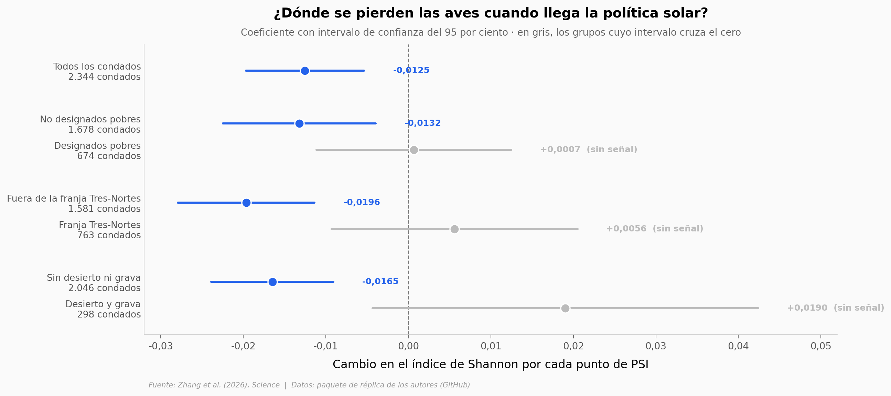

# Más hoja verde, menos aves

China empujó la instalación de paneles solares con políticas de provincia, de municipio y de condado. Zhang et al. cruzaron ese empuje contra listas de aves de ciencia ciudadana en un panel de **2.344 condados** por **120 meses** (2014-2023) y encontraron que donde la política apretó más fuerte, la diversidad de aves cayó — y el paisaje quedó, paradójicamente, más frondoso. Este notebook rehace las regresiones desde el paquete de réplica de los autores, con `reghdfe` reescrito en treinta líneas de numpy.

**El hallazgo:** por cada desviación estándar de rigor de política, un condado pierde **unas 4 especies de aves** (−0,9751 por punto de índice; 11,3 por ciento de la riqueza media) mientras su **índice de área foliar sube** (+0,0039). Los autores bautizaron esa combinación *enverdecimiento inferior*.

## Gráfica clave



## Reproducir

[](https://colab.research.google.com/github/Ciencia-a-Mordiscos/lab/blob/main/papers/2026-08-20-solar-china-aves-diversidad/notebook.ipynb)

O localmente:
```bash
pip install pandas matplotlib numpy scipy
jupyter execute notebook.ipynb
```

## Datos

- `datos/panel_base.csv` — panel de estimación condado-mes (46.371 filas, 2.344 condados, 120 meses): Shannon de aves, índice de rigor de política fotovoltaica, nueve controles, mecanismos (NDVI, luz nocturna, área foliar) y marcas de heterogeneidad.
- `datos/panel_rasgos.csv` — índices de Shannon por subcomunidad de aves (endémicas, migratorias, protegidas, por dieta, por nidificación, por bandada) más riqueza y equitatividad, en la misma llave condado-mes.

Ambos se construyeron replicando el orden exacto del do-file de Stata de los autores: el relleno del PSI faltante con cero, el descarte por controles ausentes, el recorte de colas al 1 y 99 por ciento y el descarte de singletons van en ese orden, y cambiarlo mueve los coeficientes.

## Links

- **Video:** [Ver en YouTube](https://youtube.com/shorts/N1AHpCjDQ5A)
- **Paper:** [Science — DOI: 10.1126/science.aee0747](https://doi.org/10.1126/science.aee0747)
- **Datos originales:** [Paquete de réplica de los autores (GitHub)](https://github.com/jianke22/China-s-solar-expansion-policy-reduces-bird-diversity)
