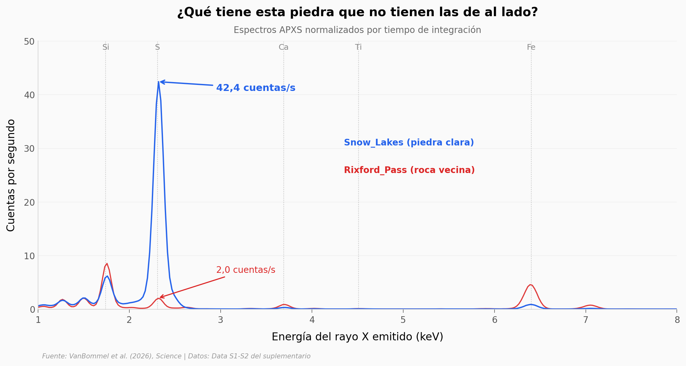

# El azufre que en Marte no debería estar suelto

Marte tiene azufre por todas partes, pero siempre agarrado a otra cosa: pegado a calcio, a magnesio, a hierro. Sulfatos y sulfuros. En el valle de Gediz, dentro del cráter Gale, Curiosity encontró un parche de unos 2.100 m² sembrado de piedras claras — y una rueda del rover partió una. Adentro no había sulfato: había azufre elemental.

**El hallazgo:** en 10 análisis del espectrómetro APXS sobre cinco de esas piedras, el azufre llega a **83,28 wt% de media** (reportado como SO₃) frente a **16,39** en las rocas vecinas del mismo valle: **+66,90 puntos, 5,08x, d de Cohen = 18,87**. Y no es solo que sobre azufre — falta todo lo demás: el hierro cae a 0,07 de su valor vecino, el calcio a 0,18, el silicio a 0,21. Los cationes que un sulfato necesitaría para existir no están.

> ⚠️ **La columna se llama `SO3_pct` y eso engaña.** El APXS mide elementos, no moléculas: cuando detecta azufre, la calibración lo reporta *como si fuera trióxido de azufre*, porque en Marte el azufre casi siempre viene en sulfatos. El propio CSV lo dice: *«Composition derived assuming SO₃»*. La conclusión del paper es la contraria — es azufre elemental, S⁰. «83 wt%» significa *azufre reportado como si fuera sulfato*, nunca «la piedra es 83% sulfato».

El notebook reconstruye los tres eslabones del argumento con los datos del suplementario: el pico de emisión, los cationes ausentes y la razón Compton/Rayleigh (1,39 vs 1,83; d = 5,60), que es una firma independiente de cuánto elemento ligero hay en la muestra. Y marca dónde termina lo medido: el origen del azufre —vapor magmático atrapado en la criosfera— es lo que los autores **proponen**, no lo que el rover midió.

## Gráfica clave



En `Snow_Lakes` la línea del azufre es la más alta del espectro, 6,88 veces el siguiente pico elemental. En `Rixford_Pass`, a unos metros, manda el silicio y el azufre se queda en un 0,24 de esa altura.

## Reproducir

[](https://colab.research.google.com/github/Ciencia-a-Mordiscos/lab/blob/main/papers/2026-08-22-azufre-nativo-gale-marte/notebook.ipynb)

O localmente:
```bash
pip install pandas matplotlib numpy scipy
jupyter execute notebook.ipynb
```

## Datos

- `datos/composicion_apxs.csv` — composición elemental de 26 análisis APXS en Gediz Vallis: 12 óxidos con su error 1σ, 3 trazas en ppm (Ni, Zn, Br) y la razón Compton/Rayleigh. La columna `grupo` separa las cuatro poblaciones (10 piedras claras, 6 Gediz Vallis fuera del depósito, 5 bloques zonados, 5 del sitio de perforación).
- `datos/espectros_apxs.csv` — espectros crudos en formato largo: 28 objetivos × 1.024 canales, con la energía calibrada y las cuentas por segundo. 28.672 filas.
- `datos/espectros_metadatos.csv` — por objetivo: sol, ganancia (eV/canal), offset, tiempo de integración y temperatura del cabezal del detector.

⚠️ El objetivo `Atmosphere` de los metadatos es un espectro de referencia acumulado, no una medición individual: sus campos `sol` y `temp_cabezal_c` traen `-99` como centinela. El notebook lo excluye de las estadísticas de tiempo.

## Links

- **Video:** [Ver en YouTube](https://youtube.com/shorts/YV4szcwYGIE)
- **Paper:** [Science — DOI: 10.1126/science.adu5501](https://doi.org/10.1126/science.adu5501)
- **Datos originales:** [Data S1 y S2, material suplementario de *Science*](https://www.science.org/doi/suppl/10.1126/science.adu5501/suppl_file/science.adu5501_data_s1_and_s2.zip)
