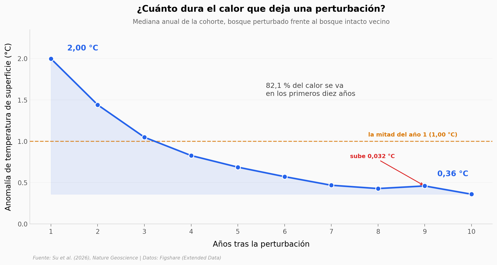

# Un bosque perturbado tarda una década en soltar el 82 % de su calor extra

Un bosque europeo que se quemó, se taló o se comieron los escarabajos está 1,70 °C más caliente en verano que el bosque intacto que tiene al lado. Este notebook abre los datos de recuperación térmica del paper y sigue la anomalía año a año: cuánto se va, cuándo, y de qué se agarra el modelo para explicarla.

**El hallazgo:** **el 82,07 % del calentamiento se disipa en diez años** — la mitad en menos de un lustro, y al año 10 todavía queda 0,36 °C.

## Gráfica clave



## Reproducir

[](https://colab.research.google.com/github/Ciencia-a-Mordiscos/lab/blob/main/papers/2026-08-25-bosques-perturbados-calor-europa/notebook.ipynb)

O localmente:

```bash
pip install pandas matplotlib numpy
jupyter execute notebook.ipynb
```

## Datos

- `datos/recuperacion_termica.csv` — trayectoria de 10 años de una cohorte (anomalía + huella térmica), 10 filas
- `datos/huella_total_anual.csv` — huella térmica anual total con cohortes solapadas, 10 filas
- `datos/importancia_predictores.csv` — contribución relativa SHAP de 21 predictores × 2 tipos de bosque, 42 filas
- `datos/shap_tamano_parche.csv` — aporte del tamaño del parche por agente (insectos, incendio, tala), 450 filas

Los CSV con las anomalías a nivel de píxel (676 MB cada uno) no se descargaron: el 1,70 °C del abstract se cita, no se replica aquí.

## Links

- **Video:** [Pendiente]
- **Paper:** [Nature Geoscience — DOI: 10.1038/s41561-026-02071-5](https://doi.org/10.1038/s41561-026-02071-5)
- **Datos originales:** [Figshare](https://doi.org/10.6084/m9.figshare.31147237)
