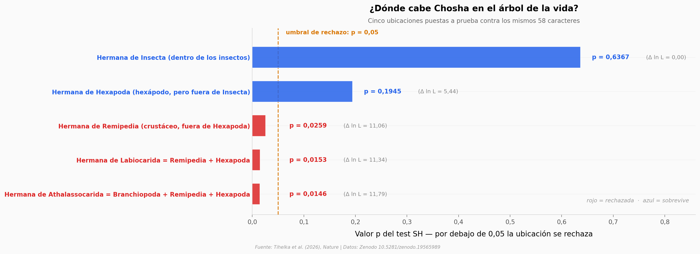

# Chosha praecursor: 26 caracteres para decidir el insecto más antiguo

Un fósil del Carbonífero en Texas, con patas abdominales en forma de remo. De los 58 caracteres anatómicos de la matriz filogenética, *Chosha praecursor* aporta 26 — y con eso hay que ubicarlo en el árbol de la vida. Este notebook abre el test de topologías, los soportes de clado y la matriz de codificación que el equipo publicó en Zenodo.

**El hallazgo:** **el test de los propios autores rechaza las 3 topologías que sacan a *Chosha* de Hexapoda (p = 0,0259 / 0,0153 / 0,0146), pero no rechaza la alternativa "hexápodo fuera de Insecta" (p = 0,1945).** Por eso el abstract dice *strongly favouring* y no *demonstrates*.

## Gráfica clave



## Reproducir

[](https://colab.research.google.com/github/Ciencia-a-Mordiscos/lab/blob/main/papers/2026-08-26-chosha-praecursor/notebook.ipynb)

O localmente:
```bash
pip install pandas matplotlib numpy
jupyter execute notebook.ipynb
```

## Datos

- `datos/test_topologias.csv` — 5 hipótesis de ubicación con ln L, Δ ln L, valor p y bandera de rechazo al 5 %
- `datos/caracteres_chosha.csv` — los 58 caracteres con nombre, región anatómica, tipo (externa / interna o blanda) y estado codificado en *Chosha*
- `datos/completitud_taxa.csv` — caracteres codificados por cada uno de los 23 taxa (5 fósiles, 18 actuales)
- `datos/soportes_clado_fosil.csv` — soporte del grupo de 4 fósiles en 6 análisis (4 bayesianos, 2 de parsimonia)
- `datos/convergencia_mcmc.csv` — diagnóstico PSRF y tamaño efectivo de muestra de los 4 análisis bayesianos

## Links

- **Video:** [Ver en YouTube](https://youtube.com/shorts/paXKj5WyKJ4)
- **Paper:** [Nature — DOI: 10.1038/s41586-026-10961-2](https://doi.org/10.1038/s41586-026-10961-2)
- **Datos originales:** [Zenodo](https://doi.org/10.5281/zenodo.19565989)
