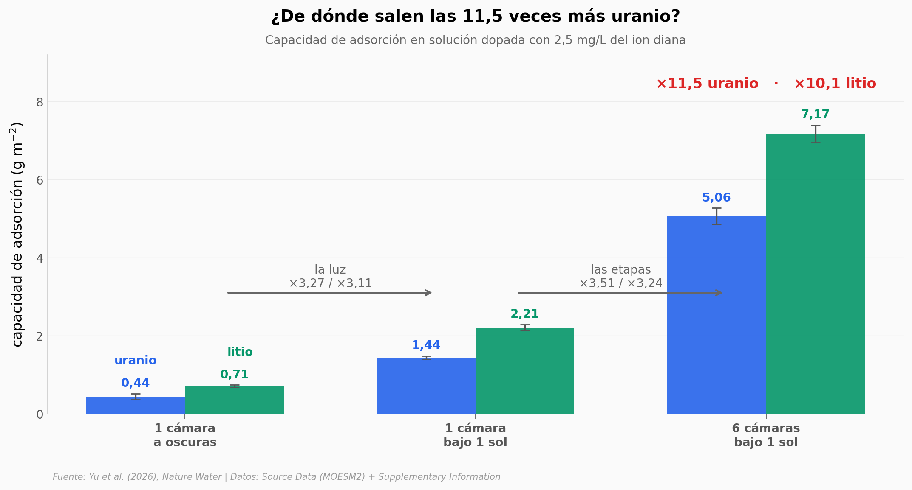

# Sol, agua de mar y una torre de seis pisos

Un equipo de Nature Water construyó un separador solar de seis cámaras apiladas que, a la vez, destila agua de mar, captura litio y uranio del agua que queda, y saca electricidad del calor que sobra. El resumen del artículo anuncia una mejora de hasta 11,6 veces en la captura de uranio bajo un sol de laboratorio. Desarmamos ese número con el Source Data del propio paper: son **dos** efectos multiplicándose —la luz y las etapas— y ambos se midieron en una solución dopada con 2,5 mg/L, unas 750 veces el uranio que hay realmente en el mar.

**El hallazgo:** **11,5x = 3,27x (la luz) × 3,51x (las etapas)** — y en la jornada exterior de Shenzhen, **ninguna de las 389 mediciones de sol alcanzó el «1 sol» con el que se midió todo el resto del paper**.

## Gráfica clave



## Reproducir

[](https://colab.research.google.com/github/Ciencia-a-Mordiscos/lab/blob/main/papers/2026-09-01-separador-solar-litio-uranio/notebook.ipynb)

O localmente:
```bash
pip install pandas matplotlib numpy scipy
jupyter execute notebook.ipynb
```

## Datos

- `datos/ac_vs_irradiancia.csv` — capacidad de adsorción de una sola cámara frente al flujo solar (0 / 0,5 / 1,0 / 1,5 soles), 4 puntos.
- `datos/rendimiento_por_etapas.csv` — agua, electricidad y captura para 1 a 6 cámaras bajo 1 sol, 6 puntos.
- `datos/ciclos_estabilidad.csv` — 20 ciclos de ~2 días (~40 días) del sistema de 6 cámaras en agua de mar dopada.
- `datos/dia_exterior.csv` — jornada exterior en Shenzhen, 5 ventanas de 2 h, agua de mar real sin dopar.
- `datos/flujo_solar_exterior.csv` — flujo solar de esa misma jornada, 389 mediciones entre las 8:02 y las 18:01.
- `datos/camaras_agua_natural.csv` — temperatura y captura de cada una de las 6 cámaras en agua de mar natural (Supplementary Table 4).
- `datos/contribucion_campos.csv` — reparto porcentual de la mejora entre los campos de temperatura, concentración y flujo, por cámara.
- `datos/campos_delta_ac.csv` — aporte de cada campo físico a 0,5 / 1,0 / 1,5 soles.
- `datos/ingreso_neto_anual.csv` — ingreso neto anual modelado según la vida útil de la mecha capilar (1 a 20 años).
- `datos/gwp_vida_util.csv` — huella de carbono total y su reducción según esa misma vida útil.

## Links

- **Video:** [Pendiente]
- **Paper:** [Nature Water — DOI: 10.1038/s44221-026-00700-2](https://doi.org/10.1038/s44221-026-00700-2)
- **Datos originales:** [Source Data (MOESM2)](https://media.springernature.com/original/springer-static/esm/art%3A10.1038%2Fs44221-026-00700-2/MediaObjects/44221_2026_700_MOESM2_ESM.xlsx) y [Supplementary Information (MOESM1)](https://media.springernature.com/original/springer-static/esm/art%3A10.1038%2Fs44221-026-00700-2/MediaObjects/44221_2026_700_MOESM1_ESM.pdf)
