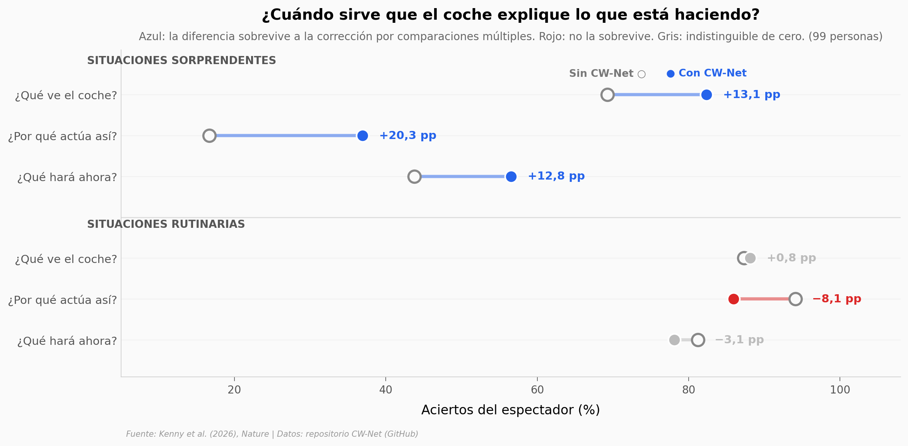

# IA explicable en un coche autónomo: ayuda solo cuando el coche hace algo raro

Los coches autónomos conducen con redes neuronales que no dicen por qué hacen lo que hacen. Kenny y su equipo construyeron **CW-Net**, una capa que obliga al planificador a razonar con conceptos que un humano entiende, y la montaron en un coche de pruebas real. Aquí reproducimos los dos estudios con humanos del paper — 99 personas con asignación aleatoria y 39 en simulador — y el resultado se parte en dos: las explicaciones sirven mucho en situaciones sorprendentes y no sirven nada en las rutinarias.

**El hallazgo:** ante situaciones sorprendentes, entender *por qué* actuaba el coche subió **20,3 puntos porcentuales** (del 16,7 % al 36,9 %, d = 1,00). Sigue siendo mayoritariamente fallo: aun con las explicaciones, dos de cada tres respuestas son incorrectas.

## Gráfica clave



## Reproducir

[](https://colab.research.google.com/github/Ciencia-a-Mordiscos/lab/blob/main/papers/2026-09-02-ia-explicable-coche-autonomo/notebook.ipynb)

O localmente:

```bash
pip install pandas matplotlib numpy scipy
jupyter execute notebook.ipynb
```

## Datos

- `datos/sagat_precision_participante.csv` — precisión por participante en el estudio SAGAT de carretera pública. 198 filas (99 personas × 2 valencias), tres dimensiones de conciencia situacional.
- `datos/sagat_efectos.csv` — las 6 comparaciones del paper ya calculadas (diferencia en puntos porcentuales, t de Welch, d de Cohen con IC 95 %, corrección de Bonferroni). Réplica exacta del log oficial del repositorio.
- `datos/simulador_modelo_mental.csv` — estudio en simulador. 117 observaciones (39 personas × 3 escenarios), cambio antes/después en modelo mental y en predicción.

Los tres derivan del repositorio público del paper aplicando su propio preprocesamiento (descarte de metadatos de Qualtrics, control de atención, tiempos mínimos de visionado). Las 6 d de Cohen y sus intervalos coinciden con el paper a tres decimales.

## Links

- **Video:** [Pendiente]
- **Paper:** [Nature — DOI: 10.1038/s41586-026-10950-5](https://doi.org/10.1038/s41586-026-10950-5)
- **Datos originales:** [EoinKenny/CW-Net-Autonomous-Driving](https://github.com/EoinKenny/CW-Net-Autonomous-Driving)
