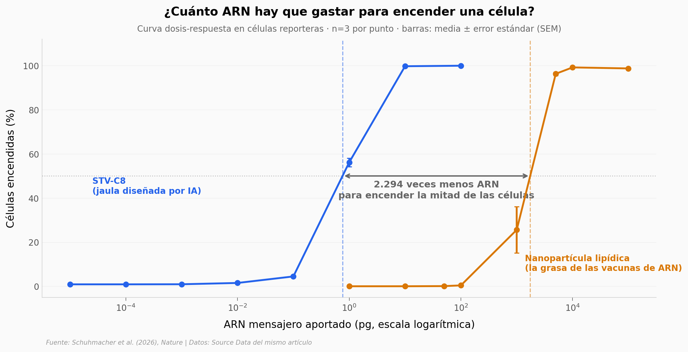

# Una IA diseñó un envase para ARN que ningún virus inventó

Los virus llevan miles de millones de años resolviendo un solo problema —meter material genético dentro de una célula ajena— y casi todos, por caminos evolutivos separados, terminaron en la misma forma de cápsula. Este equipo probó si esa convergencia era el techo o solo el camino andado: cribaron 39 jaulas de proteína dibujadas por modelos generativos, midiendo tres pasos encadenados (salir de la célula productora, llegar a la diana, entregar el ARN). Todo lo que grafica este notebook es cultivo celular.

**El hallazgo:** la jaula ganadora (**STV-C8**) gasta **12.991 veces menos ARN** que una nanopartícula lipídica para producir la misma señal — y el andamio icosaédrico, la forma a la que converge casi cualquier cápside viral, queda **28º de 39** en entrega.

## Gráfica clave



## Reproducir

[](https://colab.research.google.com/github/Ciencia-a-Mordiscos/lab/blob/main/papers/2026-09-02-vehiculos-arn-proteinas-ia/notebook.ipynb)

O localmente:

```bash
pip install pandas matplotlib numpy scipy
jupyter execute notebook.ipynb
```

## Datos

Todos salen del Source Data del propio artículo (acceso abierto).

- `datos/screening_liberacion.csv` — señal HiBiT en el sobrenadante de la célula productora: cuánto vehículo sale. 39 jaulas + control `no cage`, 236 filas (n=6, cinco constructos con n=5). Fig. 1f
- `datos/screening_captacion.csv` — reconstitución de NanoLuc en la célula diana: cuánto vehículo llega. 238 filas. Fig. 1g
- `datos/screening_entrega.csv` — Firefly partida en el lisado de la célula diana: cuánto ARN funciona. 239 filas. Fig. 1h
- `datos/dosis_por_mfi.csv` — picogramos de ARN por unidad de señal, nanopartícula lipídica contra STV-C8 (n=3). Menos es mejor. Extended Data Fig. 6h
- `datos/curva_dosis_egfp.csv` — curva dosis-respuesta, 8 dosis por vehículo (n=3). Fig. 2g
- `datos/benchmark_vehiculos.csv` — STV contra EPN, VLP y SEND a dos volúmenes (n=4; sin tratar n=3). Extended Data Fig. 6g
- `datos/rnabp_liberacion_arn.csv` — ARN liberado según el dominio que lo agarra (n=6). Fig. 1c
- `datos/reprogramacion_ascl1.csv` — astrocitos de ratón ASCL1+ tras la transducción (n=6 control / n=4 tratado). Fig. 3f
- `datos/estabilidad_sangre.csv` — entrega tras pretratar con PBS, suero o sangre completa (n=6). Fig. 3l

Las señales del cribado son **relativas a HE0902**, no eficiencias absolutas. Los tres paneles traen los constructos en orden distinto: cualquier cruce va por nombre, nunca por posición.

## Links

- **Video:** [Pendiente]
- **Paper:** [Nature — DOI: 10.1038/s41586-026-10952-3](https://doi.org/10.1038/s41586-026-10952-3)
- **Datos originales:** [Source Data (MOESM4)](https://media.springernature.com/original/springer-static/esm/art%3A10.1038%2Fs41586-026-10952-3/MediaObjects/41586_2026_10952_MOESM4_ESM.xlsx)
