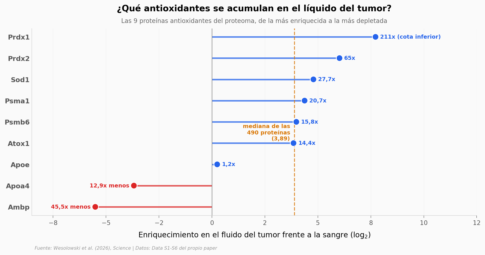

# El tumor fabrica su propio antioxidante

Los suplementos antioxidantes prometían frenar el cáncer y en los ensayos fallaron; en varios, los resultados empeoraron. Este trabajo ofrece una explicación candidata: en ratones, el tumor vierte enzimas antioxidantes en el líquido que lo rodea y con eso deja mudas a las células T que deberían atacarlo. Las células T necesitan radicales libres para transmitir la señal de ataque, y quitárselos no las envenena — las silencia.

**El hallazgo:** **la peroxirredoxina 1 (PRDX1) está al menos 211 veces más concentrada en el fluido del tumor que en la sangre**, y añadirla a células T CD8+ frena su programa de ataque solo cuando están activadas (Ifng −0,97 en log2, padj = 6,5 × 10⁻⁹) — en reposo no pasa nada (+0,02, p = 0,79).

## Gráfica clave



## Reproducir

[](https://colab.research.google.com/github/Ciencia-a-Mordiscos/lab/blob/main/papers/2026-09-03-antioxidantes-tumor-celulas-t/notebook.ipynb)

O localmente:
```bash
pip install pandas matplotlib numpy scipy
jupyter execute notebook.ipynb
```

## Datos

- `datos/proteoma_tif_vs_suero.csv` — proteómica TMT del fluido intersticial tumoral frente a suero, 490 proteínas con log2FC y marca de antioxidante
- `datos/degs_celulas_t.csv` — expresión diferencial en células T CD8+ bajo PRDX1 o NAC, con y sin estímulo del receptor; 49.214 filas en formato largo
- `datos/expresion_tif_vs_suero_celulas_t.csv` — los 3.827 genes diferenciales en células T expuestas al fluido tumoral completo a 2 h y 5 h

⚠️ **Piso de imputación:** 373 de las 490 proteínas comparten el mismo valor en suero (el mínimo detectable). PRDX1 es una de ellas, así que su 211x es una cota inferior. El notebook lo mide y lo explica.

## Links

- **Video:** [Pendiente]
- **Paper:** [Science — DOI: 10.1126/science.adz8203](https://doi.org/10.1126/science.adz8203)
- **Datos originales:** [Data S1–S6, material suplementario de Science](https://www.science.org/doi/suppl/10.1126/science.adz8203/suppl_file/science.adz8203_data_s1_to_s6.zip)
