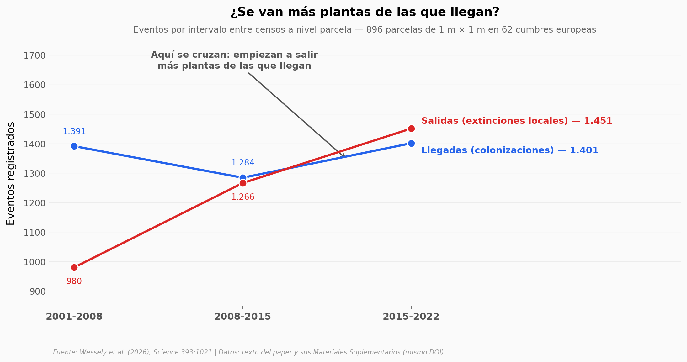

# Suben las extinciones de plantas en las cumbres de Europa

En las cimas europeas hay hoy más especies de plantas que hace veinte años, y al mismo tiempo cada censo encuentra más huecos donde antes había una planta. Las dos cosas son ciertas: entre 2001 y 2022, en 896 parcelas fijas de 1 m × 1 m repartidas por 62 cumbres de 16 regiones, la proporción de observaciones que desaparecen entre un censo y el siguiente pasó de 11,1% a 15,7% a nivel parcela. Las llegadas, en cambio, se quedaron donde estaban.

**El hallazgo:** **la extinción local subió 4,6 puntos porcentuales (+41% relativo) en 21 años, mientras la colonización no muestra tendencia alguna (p = 0,17 / 0,92 / 0,31 en los tres niveles de agregación).**

## Gráfica clave



## Reproducir

[](https://colab.research.google.com/github/Ciencia-a-Mordiscos/lab/blob/main/papers/2026-09-03-extincion-plantas-cumbres-europeas/notebook.ipynb)

O localmente:

```bash
pip install pandas matplotlib numpy
jupyter execute notebook.ipynb
```

## Datos

Ocho tablas resumen extraídas del texto del paper y de su PDF de Materiales Suplementarios (mismo DOI):

- `datos/cumbres_gloria.csv` — las 62 cumbres GLORIA: región, país, elevación, latitud/longitud, parcelas y los cuatro años de censo (Tabla S8, 62 filas)
- `datos/extinciones_por_intervalo.csv` — extinciones locales por intervalo × nivel de agregación (Tabla S1, 9 filas)
- `datos/colonizaciones_por_intervalo.csv` — colonizaciones por intervalo × nivel, contraparte simétrica (Tabla S9, 9 filas)
- `datos/modelos_extincion_vs_colonizacion.csv` — coeficientes GLMM de los cuatro modelos, con estimate, error, p y R² (Tablas S2, S5, S10 y S11, 12 filas)
- `datos/extincion_geografia.csv` — extinción ~ calentamiento + latitud + longitud (Tabla S6, 9 filas)
- `datos/cobertura_predice_extincion.csv` — el declive previo como señal de aviso temprano (Tabla S7, 8 filas)
- `datos/trayectoria_previa_extincion.csv` — reparto de las extinciones de 2022 según la trayectoria de cobertura previa (texto del paper, 3 filas)
- `datos/conteo_aparente_vs_conservador.csv` — cuenta aparente contra cuenta conservadora del último intervalo (texto del paper, 3 filas)

> El depósito de datos que cita el paper (Dryad `10.5061/dryad.vmcvdnd6v`) devuelve 404: Science publicó una corrección el 2026-09-04 declarando que el registro no está disponible. Todo lo de este notebook viene del artículo Open Access y de su Supplementary PDF.

## Links

- **Video:** [Pendiente]
- **Paper:** [Science — DOI: 10.1126/science.aed2974](https://doi.org/10.1126/science.aed2974)
- **Datos originales:** [Materiales Suplementarios del mismo DOI](https://www.science.org/doi/suppl/10.1126/science.aed2974/suppl_file/science.aed2974_sm.pdf)
- **Red de monitoreo:** [GLORIA](https://gloria.ac.at/)
