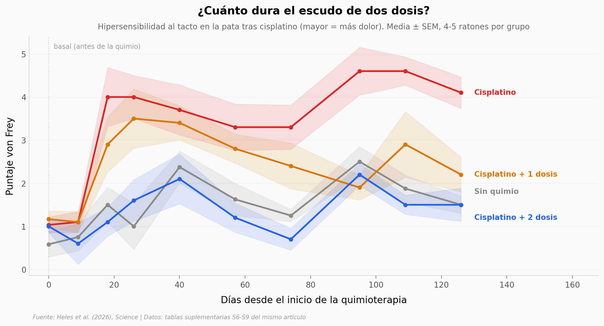

# Dos dosis antes de la quimio, y la neuropatía no apareció

La neuropatía periférica inducida por quimioterapia le pasa a millones de pacientes de cáncer: los dedos que se duermen, el pie que deja de sentir el piso. Muchas veces no se va, y no tiene tratamiento probado. Este equipo probó algo distinto: dar psilocibina **antes** de la quimio, como escudo, no después como calmante. En ratones funcionó durante 126 días.

**El hallazgo:** con **dos dosis de 1 mg/kg previas al cisplatino**, la hipersensibilidad de la pata se queda en **1,39** frente a **3,63** de la quimio sola — y deja de distinguirse de los ratones que nunca recibieron quimio (p = 0,80). Con una sola dosis hay mitigación (2,57), no prevención.

Y en el tacto hay una disociación limpia: bloquear el receptor 5HT2A en todo el cuerpo anula esa protección; bloquearlo solo en el cerebro, no. Eso vale para el tacto — en la hipersensibilidad mecánica el componente central también pesa, y el propio artículo habla de mecanismos centrales *y* periféricos.

## Gráfica clave



## Reproducir

[](https://colab.research.google.com/github/Ciencia-a-Mordiscos/lab/blob/main/papers/2026-09-03-psilocibina-neuropatia-quimio/notebook.ipynb)

O localmente:

```bash
pip install pandas matplotlib numpy scipy
jupyter execute notebook.ipynb
```

## Datos

- `datos/von_frey_dias.csv` — hipersensibilidad mecánica (von Frey) por ratón y día. 190 filas, 4 grupos, 10 días entre el 0 y el 126.
- `datos/tape_test_pre_post.csv` — agudeza táctil (retirada de cinta adhesiva), pareado pre/post. 42 filas, 7 brazos incluida la ketanserina sistémica frente a la intracerebroventricular.
- `datos/ienfd_por_grupo.csv` — densidad de fibras nerviosas intraepidérmicas. 55 filas en **dos condiciones distintas**: 1 semana con 7 mg/kg y 4 semanas con 23 mg/kg acumulados. No mezclarlas.
- `datos/vdac_axonal.csv` — área de VDAC axonal (mitocondria dentro del axón) en neuronas sensoriales humanas derivadas de iPSC. 100 axones, 4 grupos. Distribución sesgada: mediana e IQR.
- `datos/acetona_frio.csv` — alodinia al frío (test de evaporación de acetona). 24 filas, 4 grupos de n=6.

Todos salen de las tablas suplementarias S6, S8 y S9 del propio artículo.

## Advertencia

Todo lo que ocurre en un cuerpo entero es **en ratones**. Lo humano de este paper son neuronas cultivadas desde células madre y tejido ex vivo: ningún paciente recibió psilocibina. Aquí reportamos lo que el estudio midió — no es una recomendación de nada.

## Links

- **Video:** [Pendiente]
- **Paper:** [Science — DOI: 10.1126/science.aec6116](https://doi.org/10.1126/science.aec6116)
- **Datos originales:** [Tablas suplementarias S1–S12](https://www.science.org/doi/suppl/10.1126/science.aec6116/suppl_file/science.aec6116_tables_s1_to_s12.zip)
