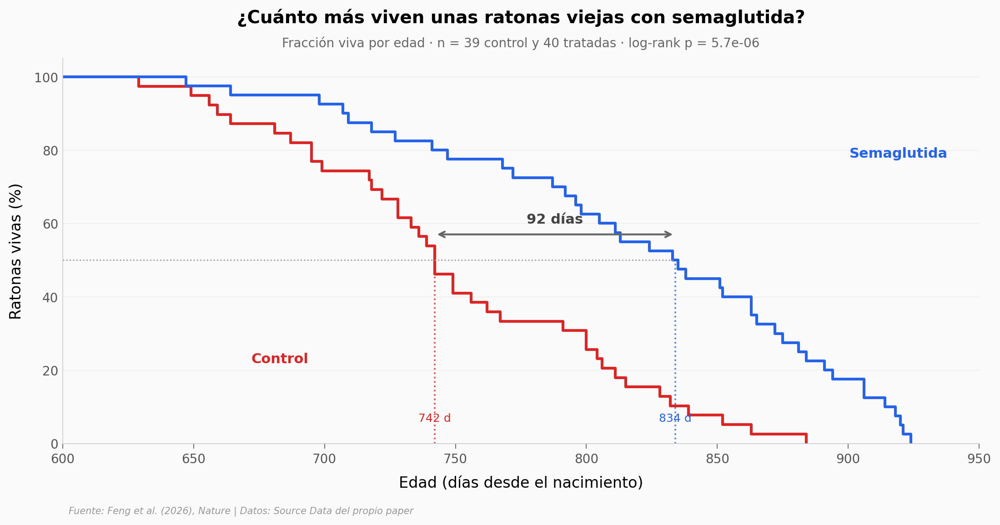

# La semaglutida alargó la vida de ratonas viejas un 12%

Un equipo trató con semaglutida —el principio activo que se hizo famoso como Ozempic— a ratonas
C57BL/6 de 20 meses, cuando ya les quedaba poca vida por delante. Las tratadas vivieron 92 días
más de mediana que las que solo recibieron suero salino, y llegaron a esa edad en mejor estado:
mejoraron en 12 de las 13 medidas independientes de una batería de pruebas físicas y cognitivas.
El paper incluye además un brazo de restricción calórica calibrado a la misma reducción de comida
que provoca el fármaco (24%), que es lo que permite separar "alarga la vida" de "quita el hambre".

**El hallazgo:** la mediana de vida pasó de **742 a 834 días** (+92 días, +12,4%; log-rank
p = 5,7 × 10⁻⁶, d de Cohen = 1,00), y frente a la dieta el fármaco mejora **3 de 9 medidas** por
encima de su propio basal mientras la restricción calórica no mejora ninguna.

## Gráfica clave



## Reproducir

[](https://colab.research.google.com/github/Ciencia-a-Mordiscos/lab/blob/main/papers/2026-09-03-semaglutida-envejecimiento-ratones/notebook.ipynb)

O localmente:
```bash
pip install pandas matplotlib numpy scipy
jupyter execute notebook.ipynb
```

## Datos

- `datos/supervivencia_ratones.csv` — edad de muerte de las 79 ratonas de longevidad (39 control, 40 tratadas), sin censura
- `datos/bateria_fisiologica_ratones.csv` — valores individuales de 14 paneles fisiológicos, n = 10 por grupo, 280 filas
- `datos/bateria_fisiologica_resumen.csv` — medias por grupo, cambio %, test y p reportados por los autores
- `datos/curva_glucosa.csv` — glucemia en mg/dl a 0/15/30/45/60/90/120 min, por ratona
- `datos/trayectorias_sema_vs_rc.csv` — 9 medidas x 3 grupos x 3 tiempos x 10 ratonas, 810 filas
- `datos/pendientes_lme.csv` — pendiente mensual y p por grupo del modelo mixto
- `datos/comparaciones_pareadas_lme.csv` — contrastes pareados entre grupos

## Advertencias

Solo ratonas **hembra** C57BL/6 y una sola dosis (10 nmol/kg/día). La cohorte de longevidad y la
de fisiología son grupos distintos. La batería de los 3 meses se analizó con tests de una cola.
No hay datos humanos.

## Links

- **Video:** [Ver en YouTube](https://youtube.com/shorts/iUNVxT6idF0)
- **Paper:** [Nature — DOI: 10.1038/s41586-026-10940-7](https://doi.org/10.1038/s41586-026-10940-7)
- **Datos originales:** [Source Data del propio paper (MOESM6 y MOESM9)](https://doi.org/10.1038/s41586-026-10940-7)
