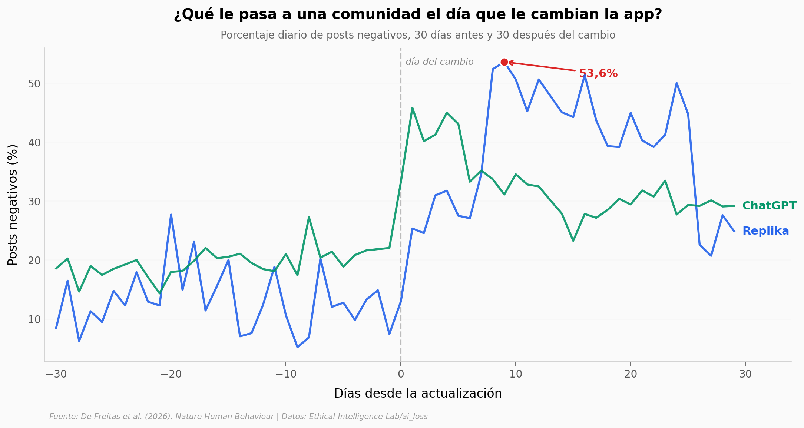

# El duelo por un compañero de IA

El 3 de febrero de 2023 Replika retiró el rol erótico de su app de compañía. Nueve días después, el 53,6% de los posts de su subreddit eran negativos; el mes anterior el promedio había sido del 13,1%. En agosto de 2025 OpenAI reemplazó los modelos anteriores de ChatGPT por GPT-5 y su comunidad también reaccionó, aunque con la mitad de intensidad. Este notebook reproduce los dos experimentos naturales del paper —54.861 posts agregados a porcentajes diarios— y dos de sus siete encuestas.

**El hallazgo:** lo que separa a las dos comunidades no es el enojo, donde casi se igualan (**+13,3 contra +9,9 puntos porcentuales**), sino la tristeza (**+10,2 contra +2,1**) y las menciones a la propia salud mental (**+3,1 contra +0,3**). A los usuarios de ChatGPT les cambiaron una herramienta y se enojaron; los de Replika hablaron de pérdida.

Con dos techos que el resumen del paper marca con cuidado y que conviene no perder: la Replika queda **más cerca que un amigo** (5,18 contra 4,44 en la escala IOS) **pero por debajo de la familia** (5,87), y se lamentaría **más que cualquier otra tecnología** (d entre 0,32 y 0,57) **pero menos que una mascota** (64,0 contra 74,8).

## Gráfica clave



## Reproducir

[](https://colab.research.google.com/github/Ciencia-a-Mordiscos/lab/blob/main/papers/2026-09-04-duelo-companeros-ia/notebook.ipynb)

O localmente:

```bash
pip install pandas matplotlib numpy scipy
jupyter execute notebook.ipynb
```

## Datos

- `datos/serie_diaria_sentimiento.csv` — serie diaria por app, 120 filas (2 apps × 60 días, ±30 del cambio). Porcentaje diario de posts negativos, tristeza, enojo, pérdida ligada al apego, salud mental y deseo de restauración, agregados desde los 54.861 posts.
- `datos/efectos_antes_despues.csv` — 12 filas (2 apps × 6 señales): medias antes/después, diferencia en puntos porcentuales, IC95 y Cohen's d.
- `datos/cercania_por_vinculo.csv` — estudio 3 (n = 101): cercanía percibida en la escala IOS (1-7) hacia 8 vínculos, con Cohen's d frente a Replika y p con Bonferroni.
- `datos/duelo_anticipado.csv` — estudio 2 (n = 120): duelo anticipado (0-100) ante la pérdida de 7 entidades, con Cohen's d y diferencia media con IC95.

## Advertencias de lectura

- **La unidad de análisis es el día, no el post.** Los contrastes corren sobre 60 días por app. Leer los tamaños del efecto como si vinieran de 54.861 observaciones los haría parecer imposibles.
- **Es cuasi-experimental.** No hay grupo control ni asignación al azar: la empresa cambió el producto para todos a la vez. El paper escribe que las actualizaciones *se asocian con* angustia de separación, y el notebook mantiene ese hedge.
- **ChatGPT no es un control**, es un segundo caso: su actualización también subió la negatividad.
- **Las emociones las etiquetó un modelo de lenguaje**, no personas.
- **El duelo es anticipado**, no vivido: se pidió imaginar la pérdida y puntuarla.

## Links

- **Video:** [Pendiente]
- **Paper:** [Nature Human Behaviour — DOI: 10.1038/s41562-026-02569-3](https://doi.org/10.1038/s41562-026-02569-3)
- **Datos originales:** [Ethical-Intelligence-Lab/ai_loss](https://github.com/Ethical-Intelligence-Lab/ai_loss)
