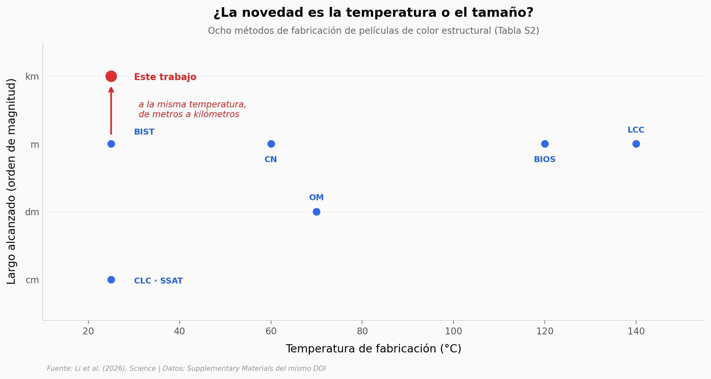

# Hasta cuatro kilómetros de película que tiene color sin llevar pigmento

Las alas de un morpho no tienen pigmento azul: tienen capas ordenadas a escala nanométrica que
devuelven el azul y dejan pasar el resto. Copiar ese truco en el laboratorio se sabe hacer desde
hace años; el problema era hacerlo grande y rápido, porque ordenar las partículas cuesta energía y
la ruta habitual es calentar y esperar. Este equipo metió monómeros comunes como mediadores para
bajar esa barrera, y con eso el simple cizallamiento de untar la mezcla sobre una lámina alcanza
para ordenarla a temperatura ambiente y en segundos. Lo llevaron a una línea roll-to-roll.

**El hallazgo:** **hasta 4.000 metros de largo por 1,3 de ancho, a 25 °C y 25 metros por minuto** —
pero 3 de los 7 métodos previos ya fabricaban a 25 °C: lo diferencial no es la temperatura, es la
escala a esa temperatura.

Y al abrir el suplementario aparece algo que el paper no comenta: sus dos instrumentos concuerdan
en el núcleo de la partícula (3,0 % de diferencia) y se separan seis veces más al añadir la coraza
(18,4 %). Medida solo la coraza, son 33,1 nm en agua contra 16,5 nm en seco.

## Gráfica clave



## Reproducir

[](https://colab.research.google.com/github/Ciencia-a-Mordiscos/lab/blob/main/papers/2026-09-04-peliculas-fotonicas-industriales/notebook.ipynb)

O localmente:
```bash
pip install pandas matplotlib numpy
jupyter execute notebook.ipynb
```

## Datos

No hay datos crudos depositados: el paper declara que todo está en el texto principal o en el
suplementario, y no existe repositorio en Zenodo, Figshare, OSF ni Dryad. Los cuatro CSV son una
transcripción a mano del Supplementary Materials, que es material revisado por pares publicado bajo
el mismo DOI.

- `datos/particulas_dls.csv` — Tabla S1: diámetro, PDI e incremento radial por etapa, 9 medidas de 3 formulaciones
- `datos/dls_vs_tem.csv` — Tabla S1 + fig. S24: el mismo objeto por dos técnicas, 6 filas
- `datos/comparacion_metodos.csv` — Tabla S2: temperatura y escala de 8 métodos de fabricación
- `datos/mecanocromismo.csv` — fig. S54B: pico de reflexión en 3 estados de esfuerzo

> **Ojo:** n = 3 formulaciones, sin réplicas ni desviación estándar publicadas. Ningún test
> estadístico es apropiado sobre estos datos, y por eso el notebook no aplica ninguno.

## Links

- **Video:** [Pendiente]
- **Paper:** [Science — DOI: 10.1126/science.aed8723](https://doi.org/10.1126/science.aed8723)
- **Datos originales:** [Supplementary Materials](https://www.science.org/doi/suppl/10.1126/science.aed8723/suppl_file/science.aed8723_sm.pdf)
