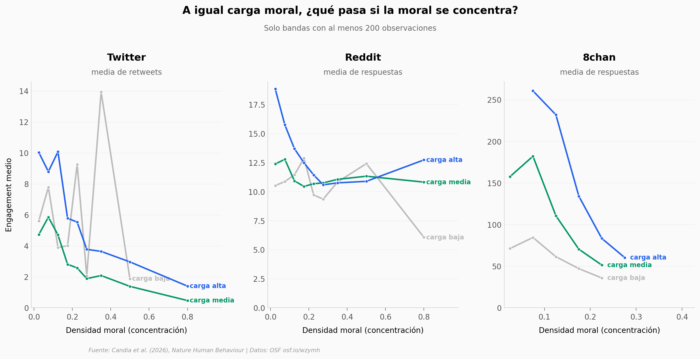

# Cuando la moral satura el mensaje

Un equipo midió 1.621.147 mensajes de Twitter, Reddit y 8chan para separar dos cosas que
suelen confundirse: cuánta relevancia moral tiene un texto y qué tan concentrada está esa
moral palabra a palabra. Las dos empujan el alcance en direcciones opuestas, y el efecto
solo aparece cuando se las mira por separado.

**El hallazgo:** a igual carga moral, más densidad moral va de la mano de **menos**
interacción — negativo en las **9 combinaciones** de plataforma × tercil de carga, hasta
**4,32 veces menos** respuestas en el caso más nítido (8chan, carga alta).

## Gráfica clave



## Reproducir

[](https://colab.research.google.com/github/Ciencia-a-Mordiscos/lab/blob/main/papers/2026-09-04-saturacion-moral-redes-sociales/notebook.ipynb)

O localmente:
```bash
pip install pandas matplotlib numpy scipy
jupyter execute notebook.ipynb
```

## Datos

Todos los CSV se derivan del paquete público de replicación en OSF. Los archivos de
features originales pesan 461 MB; aquí van ya agregados.

- `datos/muestra_por_canal.csv` — cascada de muestra por canal: filas brutas, filas de
  modelo y excluidos por datos faltantes. 13 filas.
- `datos/curva_densidad_plataforma.csv` — curva cruda de interacción contra densidad moral,
  9 bandas × 3 plataformas. Sin ajustar por covariables. 27 filas.
- `datos/densidad_por_carga_moral.csv` — interacción por banda de densidad dentro de cada
  tercil de carga moral. Es la tabla que reproduce el hallazgo condicional. 79 filas.
- `datos/aic_penalizacion_vs_difusion.csv` — Tabla 1 del paper: AIC del modelo de
  penalización contra el de difusión, por canal. 13 filas.
- `datos/mediacion_ddr.csv` — Tabla 2 del paper: análisis de mediación con la carga
  cognitiva del texto como intermediario. 15 filas.
- `datos/comparacion_medidas_morales.csv` — submuestras de unos 2.000 mensajes por
  plataforma puntuadas con cuatro medidas distintas de moralidad. 5.971 filas.
- `datos/diccionario_columnas_original.csv` — diccionario de columnas del paquete OSF.

## Links

- **Video:** [Pendiente]
- **Paper:** [Nature Human Behaviour — DOI: 10.1038/s41562-026-02560-y](https://doi.org/10.1038/s41562-026-02560-y)
- **Datos originales:** [Repositorio público en OSF](https://osf.io/wzymh/)
