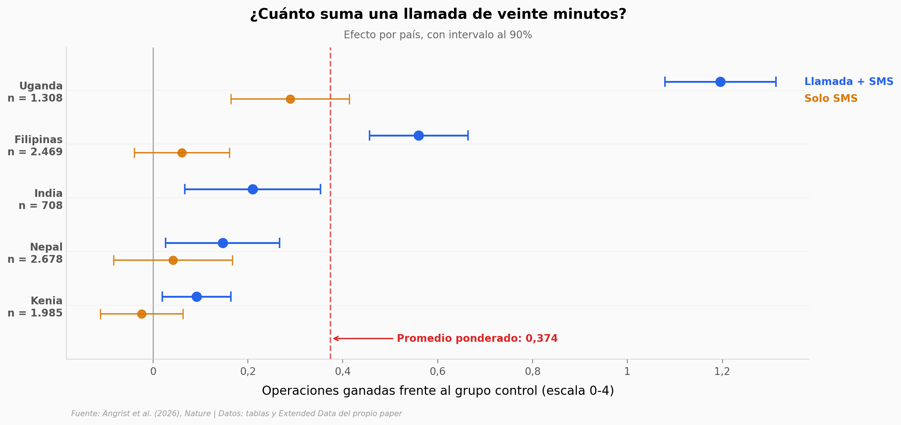

# Once dólares, un teléfono de teclas y cinco países

Cuando una epidemia o una inundación cierra las escuelas, la respuesta habitual es mudar la clase a internet — pero en los países donde eso pasa más, menos del 15% de los hogares tiene conexión y más del 70% tiene un celular. Un equipo probó enseñar matemáticas por llamada telefónica en cinco ensayos aleatorizados simultáneos (India, Kenia, Nepal, Filipinas y Uganda) y midió qué tanto aguanta el aprendizaje sin aula. La llamada movió la aguja en los cinco países; el mensaje de texto por sí solo, casi en ninguno.

**El hallazgo:** la tutoría por llamada rinde **0,321 desviaciones estándar** contra **0,078** del SMS solo — **4,1 veces más** — a **US$11 por niño**. Pero el efecto no se parece entre países: va de **0,092 operaciones ganadas en Kenia a 1,196 en Uganda**, trece veces de diferencia, con un **I² del 98,0%**.

## Gráfica clave



## Reproducir

[](https://colab.research.google.com/github/Ciencia-a-Mordiscos/lab/blob/main/papers/2026-09-09-tutorias-telefono-cinco-paises/notebook.ipynb)

O localmente:

```bash
pip install pandas matplotlib numpy scipy
jupyter execute notebook.ipynb
```

## Datos

No hay microdatos a nivel de niño: el repositorio de replicación que anuncia el paper está vacío. Los CSV de abajo son transcripciones de las tablas de estimaciones publicadas, así que se pueden recalcular agregados y heterogeneidad, pero no reanalizar la muestra.

- `datos/efectos_por_pais.csv` — efecto de cada brazo en cada país, con y sin controles (9 filas, Extended Data Table 1)
- `datos/efectos_agrupados_sd.csv` — efecto agrupado en desviaciones estándar, 4 especificaciones × 2 brazos (8 filas, Extended Data Table 2)
- `datos/gobierno_vs_ong.csv` — entrega por docentes de gobierno frente a instructores de ONG, en Nepal y Filipinas (9 filas, Table 1)
- `datos/descripcion_ensayos.csv` — los cinco ensayos: muestra, grados, unidad de aleatorización, fechas, implementador (5 filas, Table 4)
- `datos/creencias_docentes.csv` — prácticas y creencias de los 290 docentes que hicieron las llamadas (4 filas, Table 3)
- `datos/costo_efectividad.csv` — LAYS por US$100 y costo por niño, con el comparador presencial (3 filas, texto principal)

## Links

- **Video:** [Pendiente]
- **Paper:** [Nature — DOI: 10.1038/s41586-026-10990-x](https://doi.org/10.1038/s41586-026-10990-x)
- **Datos originales:** [Tablas y Extended Data del propio paper](https://www.nature.com/articles/s41586-026-10990-x/tables/5)
