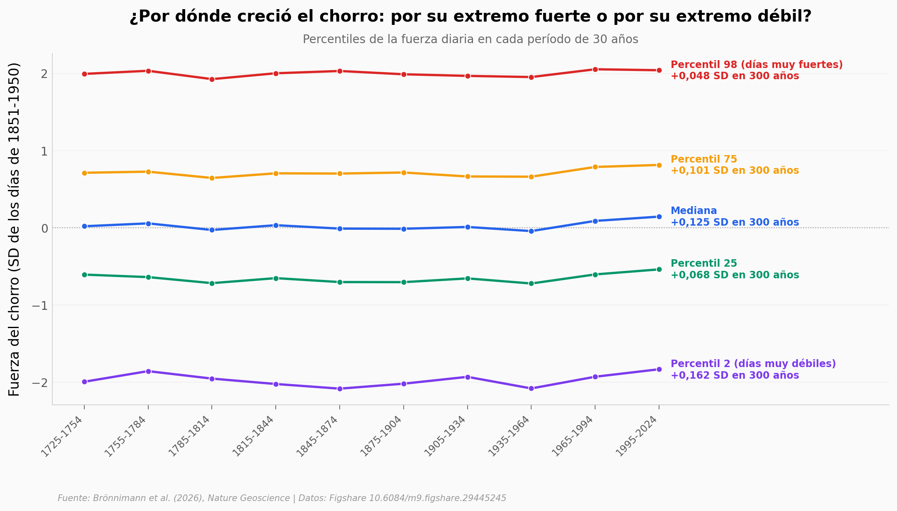

# El chorro del Atlántico se fortaleció por su lado débil

Cuatro barómetros europeos —Londres, Padua, Uppsala y Berlín— llevan anotando la presión todos los días desde 1725. Con esas series, un equipo reconstruyó día a día la fuerza, la inclinación y la latitud de la corriente en chorro del Atlántico durante 300 años. Aquí reproducimos la mitad observacional de ese trabajo: 54.373 días de temporada fría (noviembre-abril), repartidos en diez períodos de 30 años.

**El hallazgo:** la mediana de la fuerza del chorro subió **+0,125 SD** desde el período preindustrial, pero el crecimiento no vino de arriba. El percentil 2 —el borde de los días más flojos— subió **+0,162 SD**, mientras que el percentil 98 apenas se movió (**+0,048 SD**). El chorro no ganó techo: perdió suelo. Los días de chorro parado son hoy los más raros del registro (**1,27%**, contra 2,00% en 1725-1754).

Y una advertencia que el notebook no esconde: el efecto es **pequeño** (Cohen's d = 0,10). Significativo no es sinónimo de grande.

## Gráfica clave



## Reproducir

[](https://colab.research.google.com/github/Ciencia-a-Mordiscos/lab/blob/main/papers/2026-09-10-corriente-chorro-atlantico-europea/notebook.ipynb)

O localmente:
```bash
pip install pandas matplotlib numpy scipy
jupyter execute notebook.ipynb
```

## Datos

- `datos/indices_diarios_temporada_fria.csv` — índices diarios de fuerza, inclinación y latitud, temporada fría 1725-2024 (54.373 filas)
- `datos/serie_anual_temporada_fria.csv` — media de cada temporada fría por año (300 filas)
- `datos/distribucion_por_periodo.csv` — percentiles 2/25/50/75/98, media y std por período de 30 años (10 filas)
- `datos/extremos_por_periodo.csv` — porcentaje de días fuera de ±2 SD por período y por cola (10 filas)

> Las columnas del depósito original **no son z-scores unitarios**. El notebook las divide por la SD de los índices diarios de temporada fría en 1851-1950 (1,52 · 0,8989 · 1,0059), que es la base que usa el paper para sus titulares.

## Links

- **Video:** [Pendiente]
- **Paper:** [Nature Geoscience — DOI: 10.1038/s41561-026-02069-z](https://doi.org/10.1038/s41561-026-02069-z)
- **Datos originales:** [Figshare 10.6084/m9.figshare.29445245](https://doi.org/10.6084/m9.figshare.29445245)
