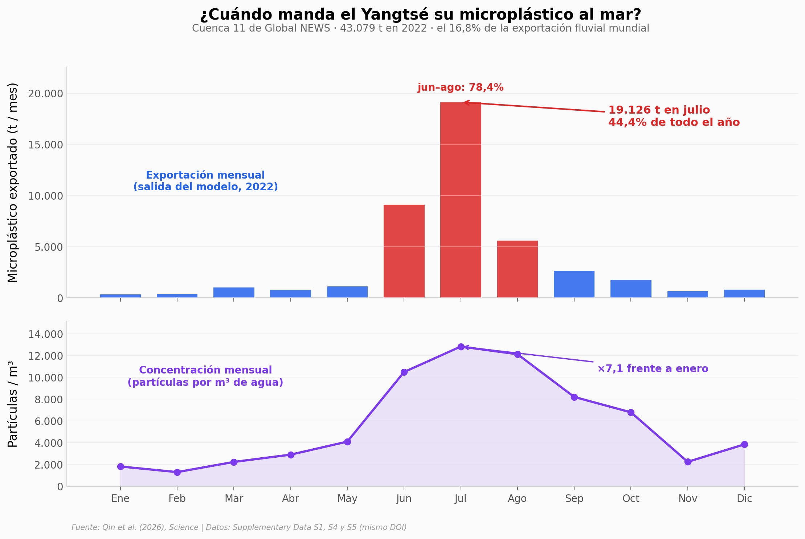

# El Yangtsé exporta en julio 62 veces más microplástico que en enero

Qin et al. reunieron 1.386 mediciones de microplástico en 226 ríos, las armonizaron a un mismo rango de tamaño y entrenaron un modelo global que estima unas 263.000 toneladas exportadas al mar en 2022 — muy por encima de la mayoría de estimaciones previas. Con la salida mensual del modelo (Supplementary Data S4 y S5) reconstruimos el reparto en el espacio y en el tiempo: 22 cuencas juntan la mitad del total, el Yangtsé solo el 16,8%, y en julio el Yangtsé suelta el 44,4% de todo su año porque la concentración (×7,1) y el caudal (×8,7) suben a la vez — el «enriquecimiento por pulso» del paper.

**El hallazgo:** **el Yangtsé exporta 61,7 veces más microplástico en julio que en enero (19.126 t frente a 310 t)** — no porque baje más agua, sino porque el agua de la temporada de lluvias viene 7,1 veces más cargada.

## Gráfica clave



## Reproducir

[](https://colab.research.google.com/github/Ciencia-a-Mordiscos/lab/blob/main/papers/2026-09-10-microplasticos-rios-pulsos/notebook.ipynb)

O localmente:
```bash
pip install pandas matplotlib numpy scipy
jupyter execute notebook.ipynb
```

## Datos

- `datos/export_mensual_cuenca.csv` — Data S5: exportación mensual de microplástico (t/mes) por cuenca Global NEWS, 2022. 5.272 cuencas (308 con exportación 0).
- `datos/concentracion_mensual_cuenca.csv` — Data S4: concentración mensual (partículas/m³) por cuenca, 2022, más fracciones anuales de polietileno y polipropileno. 5.261 cuencas.
- `datos/observaciones_rios.csv` — Data S1: 1.386 observaciones de concentración (cruda y armonizada a 50–5.000 µm) con coordenadas, año, río, malla y método. Columnas `malla_um`, `anio` y `region_aprox` añadidas por El Lab; 17 filas del río Aras con años 2023–2039 (autorrelleno de Excel) → año vacío; 5 filas del río Suquía con lon/lat intercambiadas → corregidas.
- `datos/cuenca_resumen.csv` — derivado por El Lab: exportación anual y ρ de Spearman (concentración vs caudal-proxy, 12 meses) por cuenca.
- `datos/perfil_vertical.csv` — Data S2: 11 perfiles verticales de concentración normalizada a superficie (no usado en el notebook).
- `datos/tamanos_particulas.csv` — Data S6: 217 registros de fracción por bin de tamaño (no usado en el notebook).

## Links

- **Video:** [Ver en YouTube](https://youtube.com/shorts/t90Hjo0PNq4)
- **Paper:** [Science — DOI: 10.1126/science.aeb4487](https://doi.org/10.1126/science.aeb4487)
- **Datos originales:** [Supplementary Data S1–S6 (Science, mismo DOI)](https://www.science.org/doi/suppl/10.1126/science.aeb4487/suppl_file/science.aeb4487_data_s1_to_s6.zip)
