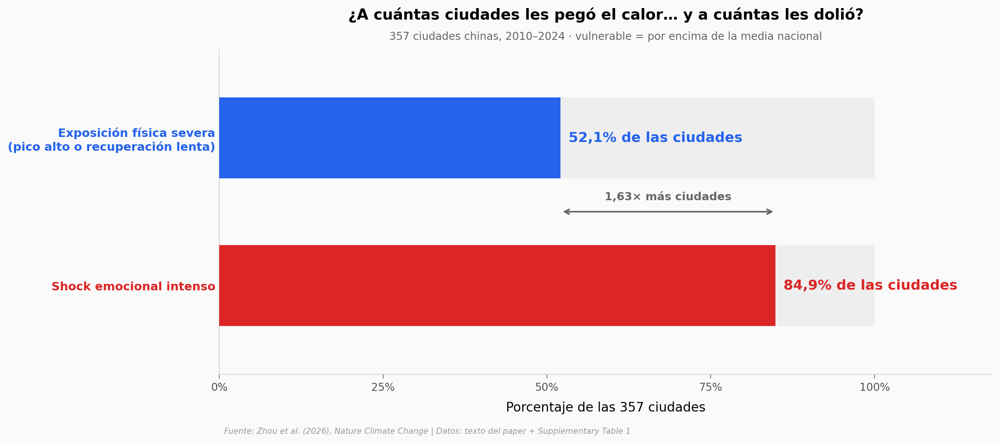

# El 85% de las ciudades chinas sintió un calor que solo el 52% sufrió

Entre 2010 y 2024, el 52,1% de las 357 ciudades chinas analizadas pasó olas de calor físicamente severas, pero el 84,9% recibió un golpe emocional de alta intensidad, medido en 11 millones de comentarios de Weibo cruzados con temperatura ERA5-Land. Las dos resiliencias se apoyan en cosas distintas: la física, en economía y cobertura del suelo; la emocional, en el peligro térmico en sí. Hacia 2050 las proyecciones apuntan a que la emocional se erosiona antes — aunque los intervalos de confianza se solapan.

**El hallazgo:** **1,63 veces más ciudades son emocionalmente vulnerables (84,9%) que físicamente vulnerables (52,1%)**, y en 39 ciudades el retraso entre el pico de calor y la caída del ánimo crece hacia el norte (ρ de Spearman = 0,68).

## Gráfica clave



## Reproducir

[](https://colab.research.google.com/github/Ciencia-a-Mordiscos/lab/blob/main/papers/2026-09-11-calor-emocional-ciudades-china/notebook.ipynb)

O localmente:
```bash
pip install pandas matplotlib numpy scipy
jupyter execute notebook.ipynb
```

## Datos

- `datos/lag_emocional_ciudades.csv` — 39 ciudades de la Supplementary Table 1: Mann-Kendall, Sen slope y mejor lag (días). Latitud/longitud aproximadas añadidas por El Lab.
- `datos/vulnerabilidad_por_cluster.csv` — % de ciudades vulnerables, nacional y por aglomeración (Fig. 2).
- `datos/indices_estratificados.csv` — HGI y EGI medios nacionales con IC 90% y brechas por decil/clima/gradiente urbano (Fig. 1).
- `datos/lag_por_region.csv` — lag medio por región y zona climática (Fig. 3).
- `datos/importancia_shap.csv` — importancia SHAP por grupo y efectos marginales sobre EGI (Fig. 4).
- `datos/proyecciones_ssp.csv` — cambios proyectados 2025–2050 y 2025–2100 por escenario SSP, con IC 90% (Fig. 5).
- `datos/trayectoria_2010_2024.csv` — trayectoria relativa de HGI y EGI 2010–2024 (Supp. Fig. 8).

## Links

- **Video:** [Ver en YouTube](https://youtube.com/shorts/PgDiWfWVC8c)
- **Paper:** [Nature Climate Change — DOI: 10.1038/s41558-026-02732-8](https://doi.org/10.1038/s41558-026-02732-8)
- **Datos originales:** [Figshare — Emotion Comments Dataset (11 millones de comentarios, 892 MB, no abierto aquí)](https://doi.org/10.6084/m9.figshare.31083328)
