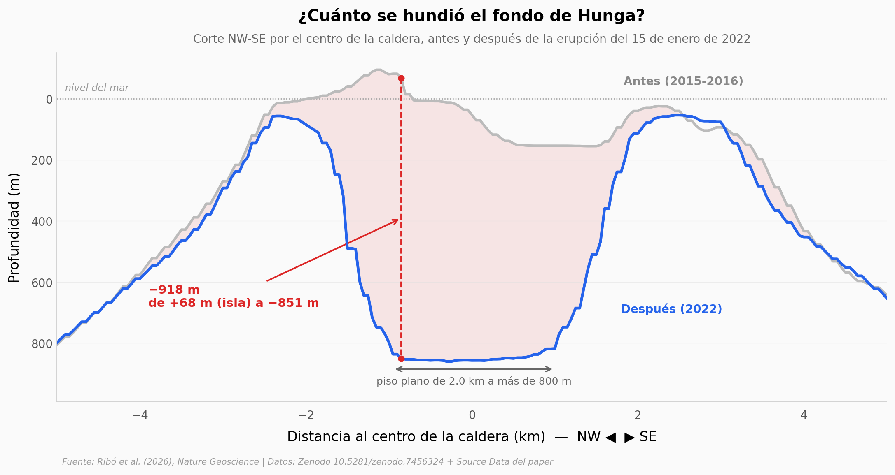

# Donde había una isla, ahora hay 850 metros de agua

El 15 de enero de 2022 el volcán Hunga (Tonga) produjo una de las erupciones más explosivas del último siglo. Restando dos modelos del fondo marino —uno de 2015-2016 y otro de abril-octubre de 2022— se ve el resultado: el piso de la caldera bajó de unos 150 m de profundidad a un piso plano de 2 km de ancho a más de 800 m. Desaparecieron 6,97 km³ de material en un radio de 4 km (el paper atribuye 6,85 km³ al colapso). Comparada con 176 calderas del mundo, Hunga es pequeña (12,4% inferior por diámetro) pero de las más hondas para su tamaño: solo 12 tienen una relación hundimiento/diámetro mayor.

**El hallazgo:** **El punto que más se hundió cayó 918 m — de 68 m sobre el mar a 851 m bajo el agua — y el hundimiento total coincide al 2% con el volumen que el paper atribuye al colapso.**

## Gráfica clave



## Reproducir

[](https://colab.research.google.com/github/Ciencia-a-Mordiscos/lab/blob/main/papers/2026-09-11-hunga-caldera-colapso-submarino/notebook.ipynb)

O localmente:
```bash
pip install pandas matplotlib numpy scipy
jupyter execute notebook.ipynb
```

## Datos

- `datos/cambio_fondo_caldera.csv` — diferencia post − pre del fondo marino en celdas de 100 m, ventana de ±5 km alrededor del centro de la caldera (9.823 celdas). Derivado de los DEM de 50 m de Zenodo.
- `datos/perfiles_caldera.csv` — tres cortes (E-W, N-S, NW-SE) por el centro a 50 m de resolución, pre y post (584 puntos).
- `datos/estaciones_ctd_abril2022.csv` — 13 sondeos CTD dentro de la caldera, 13-16 de abril de 2022 (89–852 m). Source Data del paper.
- `datos/calderas_globales.csv` — base global de 177 calderas (diámetro, hundimiento, volumen de magma, relación de aspecto) compilada por los autores. Source Data del paper.

## Links

- **Video:** [Pendiente]
- **Paper:** [Nature Geoscience — DOI: 10.1038/s41561-026-02099-7](https://doi.org/10.1038/s41561-026-02099-7)
- **Datos originales:** [Zenodo 10.5281/zenodo.7456324](https://doi.org/10.5281/zenodo.7456324) (DEM pre y post, CC BY 4.0) + Source Data del paper
