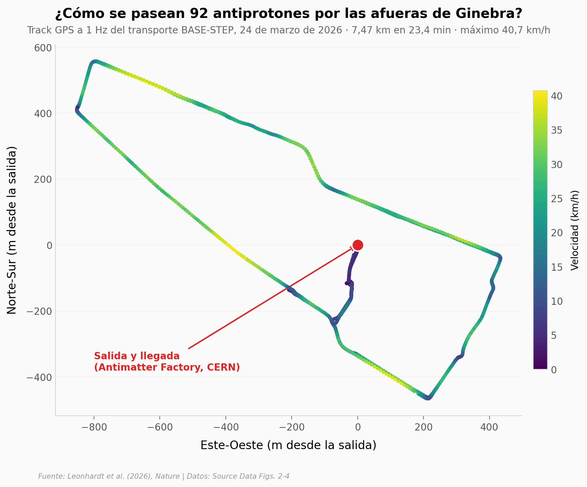

# 92 antiprotones, 7,5 km por carretera, ninguno perdido

El equipo BASE-STEP cargó 92 antiprotones en una trampa de Penning portátil, la subió a un camión y la sacó a la vía pública en las afueras del CERN: 7,47 km en 23 minutos, con picos de 40,7 km/h. Después siguieron contando partículas durante 33 días. Este notebook reconstruye el viaje desde el track GPS, compara el número de antiprotones antes y después del transporte, muestra cómo se ve la única pérdida del mes (una partícula, nueve días después, en el laboratorio) y replica la cuenta que convierte "cero aniquilaciones" en un límite de presión.

**El hallazgo:** la diferencia de medias 24 h después − 24 h antes del transporte es de −0,16 ± 0,04 partículas, muy por debajo del escalón de 1 antiprotón (3,633 Hz). El vacío de la trampa queda acotado por debajo de 2,2×10⁻¹⁸ mbar (He): menos de 4 moléculas por cm³.

## Gráfica clave



## Reproducir

[](https://colab.research.google.com/github/Ciencia-a-Mordiscos/lab/blob/main/papers/2026-09-16-antiprotones-transporte/notebook.ipynb)

O localmente:
```bash
pip install pandas matplotlib numpy
jupyter execute notebook.ipynb
```

## Datos

- `datos/ruta_gps.csv` — track GPS a 1 Hz del transporte (24-03-2026, 08:59–09:22 UTC), 1.396 puntos; distancia acumulada, velocidad y coordenadas locales derivadas conservando el orden de registro (Source Data Fig. 2)
- `datos/antiprotones_33_dias.csv` — número de antiprotones (continuo, calibrado del ancho de dip) vs días desde la inyección, 8.868 medidas, con campo magnético (Source Data Fig. 3)
- `datos/antiprotones_por_dia.csv` — agregado por día calendario: media, SD, n, campo, entero redondeado (33 filas, derivado del anterior)
- `datos/extraccion_rendimiento.csv` — rendimiento de extracción vs posición del centro de masa, 14 puntos con error 1σ (Source Data Fig. 4)

## Links

- **Video:** [Ver en YouTube](https://youtube.com/shorts/eJAKC-92BEk)
- **Paper:** [Nature — DOI: 10.1038/s41586-026-11019-z](https://doi.org/10.1038/s41586-026-11019-z) · CC BY 4.0
- **Datos originales:** [Source Data del paper (MOESM2–4)](https://www.nature.com/articles/s41586-026-11019-z#Sec27)
