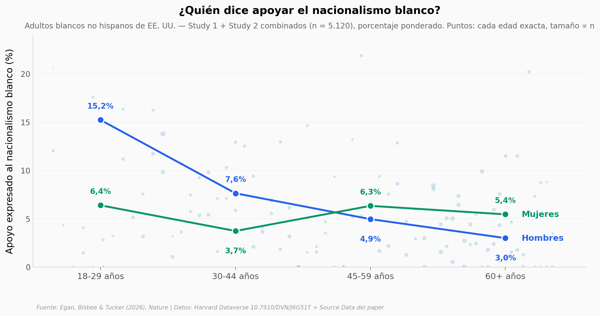

# 4,9% de los adultos blancos. 13,5% de los hombres blancos de 18 a 29.

Tres encuestas nacionales en Estados Unidos hicieron algo que nadie había hecho: describir al encuestado qué defiende el movimiento nacionalista blanco y preguntarle directamente si lo apoya. En la muestra probabilística (NORC, 2024, n = 2.114), 4,9% de los adultos blancos no hispanos dice que sí. Entre los hombres de 18 a 29 años, 13,5% (n = 137, intervalo ancho). En hombres el apoyo cae con la edad; en mujeres es plano. Explicar el movimiento antes de preguntar duplica el apoyo expresado en la encuesta grande de 2021 — pero no en la probabilística.

**El hallazgo:** **4,9% de los adultos blancos de EE. UU. expresa apoyo al nacionalismo blanco; entre hombres de 18-29, 13,5% — solo 28 de 10.000 grupos aleatorios del mismo tamaño llegan a esa cifra.**

## Gráfica clave



## Reproducir

[](https://colab.research.google.com/github/Ciencia-a-Mordiscos/lab/blob/main/papers/2026-09-16-nacionalismo-blanco-predictores-eeuu/notebook.ipynb)

O localmente:
```bash
pip install pandas matplotlib numpy scipy
jupyter execute notebook.ipynb
```

## Datos

- `datos/study1_ces_2021.csv` — microdatos Study 1 (CES/YouGov 2021), 3.227 encuestados blancos no hispanos, 28 columnas con etiquetas en español
- `datos/study2_norc_2024.csv` — microdatos Study 2 (NORC AmeriSpeak 2024), 2.146 filas (2.114 con respuesta), 18 columnas
- `datos/fig4_edad_genero_pooled.csv` — prevalencia ponderada por edad (18-79) × género, Study 1 + 2 combinados (Source Data Fig. 4)
- `datos/fig1_experimento_tres_estudios.csv`, `fig1_moderadores_study1.csv`, `fig2_*.csv`, `fig3_teorias_study1.csv`, `edfig1_covariables_study2.csv` — Source Data del paper (Figs. 1-3, Extended Data Fig. 1), no usados por el notebook pero incluidos para cross-check

## Links

- **Video:** [Ver en YouTube](https://youtube.com/shorts/D5TZfg9y_DE)
- **Paper:** [Nature — DOI: 10.1038/s41586-026-11018-0](https://doi.org/10.1038/s41586-026-11018-0)
- **Datos originales:** [Harvard Dataverse 10.7910/DVN/J6G51T](https://doi.org/10.7910/DVN/J6G51T) (replicación, CC0)
