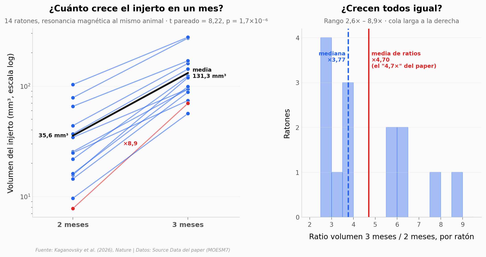

# Un ratón con el córtex casi entero de células humanas. ¿Camina igual?

Eliminaron las neuronas excitadoras del córtex y el hipocampo de un ratón antes de nacer y rellenaron el hueco, el día del nacimiento, con cuatro organoides corticales humanos. Tres meses después el injerto ocupaba el 91,9% del tejido cortical, había crecido 4,7 veces en un mes y contenía neuronas de proyección de capa 5. El ratón corría igual de rápido que un control — pero apoyaba las patas de otra manera y, a diferencia del ratón sin córtex, volvía a alternar brazos en el laberinto por encima del azar.

**El hallazgo:** un córtex de ratón hecho al 91,9% de células humanas conserva la locomoción básica (ANOVA p = 0,85) con diferencias selectivas de coordinación (ratio alterno/cruzado, p = 0,0039).

## Gráfica clave



## Reproducir

[](https://colab.research.google.com/github/Ciencia-a-Mordiscos/lab/blob/main/papers/2026-09-16-xenocortex-organoides-humanos-raton/notebook.ipynb)

O localmente:
```bash
pip install pandas matplotlib numpy scipy
jupyter execute notebook.ipynb
```

## Datos

- `datos/volumen_cerebro_control_vs_apalial.csv` — volumen gris+blanca por MRI, control (n=5) vs apalial (n=4)
- `datos/crecimiento_injerto_mri.csv` — volumen del injerto a 2 y 3 meses, pareado por ratón (n=14)
- `datos/porcentaje_cortex_humano.csv` — % de tejido cortical humano a 3 meses (n=7)
- `datos/clusters_glun_snrnaseq.csv` — % de núcleos por cluster excitador, 3 injertos × 2 réplicas
- `datos/catwalk_velocidad.csv` — velocidad media de carrera (cm/s), n = 16/10/7
- `datos/catwalk_patas_en_suelo.csv` — % de tiempo por patrón de apoyo, promedio por grupo (sin réplicas)
- `datos/catwalk_ratio_alterno_cruzado.csv` — ratio secuencias alternas/cruzadas por ratón
- `datos/ymaze.csv` — distancia y % alternancia espontánea, n = 39/16/18
- `datos/soma_diametro_ven.csv` — diámetro máximo de soma de 1.098 células tipo VEN

## Links

- **Video:** [Pendiente]
- **Paper:** [Nature — DOI: 10.1038/s41586-026-11032-2](https://doi.org/10.1038/s41586-026-11032-2)
- **Datos originales:** [Source Data MOESM7](https://media.springernature.com/original/springer-static/esm/art%3A10.1038%2Fs41586-026-11032-2/MediaObjects/41586_2026_11032_MOESM7_ESM.zip)
