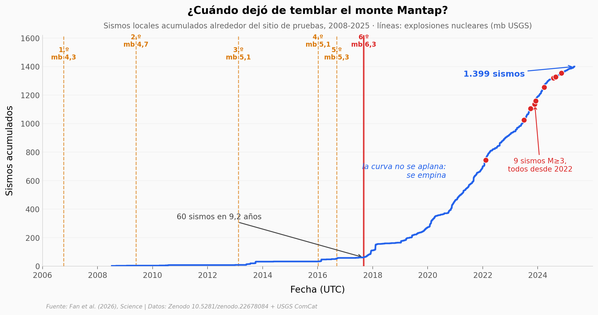

# Seis bombas nucleares bajo una montaña, y la montaña sigue temblando

Corea del Norte detonó seis bombas nucleares bajo el monte Mantap entre 2006 y 2017. Fan y colegas construyeron un catálogo de 17 años de sismos alrededor del sitio de pruebas de Punggye-ri: 1.399 sismos locales, 955 relocalizados con precisión. Este notebook reconstruye la curva acumulada, compara la tasa antes y después del 6.º test, filtra por el umbral de completitud, mapea los relocalizados, ajusta la ley de Gutenberg-Richter y comprueba el sesgo de detección nocturna.

**El hallazgo:** el 95,7% de los sismos ocurrió después de la última explosión, y la curva no se aplana: se empina. De 6,6 sismos/año antes del 6.º test a 174,9 después (×26,7); de 54 sismos en 2018 a 263 en 2023 (×4,9), también por encima del umbral de completitud (33 → 205). Los 9 sismos M ≥ 3 llegaron entre 2022 y 2024. Valor b = 1,11 ± 0,04: sismos tectónicos de manual, solo que muchos, tarde y en aumento.

## Gráfica clave



## Reproducir

[](https://colab.research.google.com/github/Ciencia-a-Mordiscos/lab/blob/main/papers/2026-09-17-mt-mantap-pruebas-nucleares-fallas/notebook.ipynb)

O localmente:
```bash
pip install pandas matplotlib numpy
jupyter execute notebook.ipynb
```

## Datos

- `datos/sismos_catalogo_inicial.csv` — Data S1: catálogo inicial (matched-filter), 1.399 sismos, 2008-07-08 → 2025-05-01, magnitud local 0,6-3,4
- `datos/sismos_relocalizados.csv` — Data S2: 955 sismos relocalizados con hypoDD (subconjunto del anterior, misma clave `evento_id`)
- `datos/explosiones_nucleares_usgs.csv` — 6 explosiones nucleares (mb 4,3-6,3) + colapso de cavidad del 2017-09-03, del catálogo USGS ComCat
- `datos/sismos_historicos_200km.csv` — Table S1 del suplementario: 25 sismos históricos 1424-1810 dentro de 200 km

## Links

- **Video:** [Pendiente]
- **Paper:** [Science — DOI: 10.1126/science.adx5917](https://doi.org/10.1126/science.adx5917)
- **Datos originales:** [Zenodo 10.5281/zenodo.22678084](https://doi.org/10.5281/zenodo.22678084)
