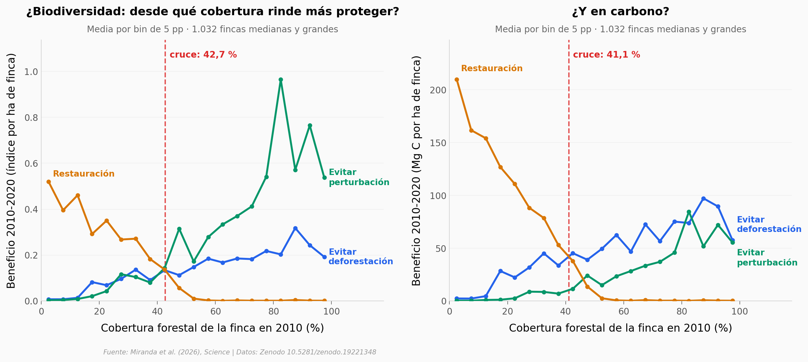

# ¿Sembrar árboles o cuidar los que ya están? En la Amazonía, restaurar rinde una cuarta parte

En 6.900 fincas de la frontera de deforestación de la Amazonía brasileña (Santarém y Paragominas, Pará), un modelo contrafactual 2010-2020 compara tres intervenciones: evitar la deforestación, evitar la perturbación (tala selectiva y fuego) y restaurar. Evitar la perturbación aporta 2,28 veces la biodiversidad que aporta evitar la deforestación; evitar la deforestación aporta 1,44 veces el carbono que aporta evitar la perturbación; la restauración queda última en ambos, con 0,26-0,27 veces lo que rinde evitar deforestar. Restaurar solo supera a proteger en fincas con menos del 41-43 % de bosque.

**El hallazgo:** **la restauración rinde una cuarta parte de lo que rinde evitar la deforestación, y solo gana en fincas con menos de ~42 % de cobertura forestal.**

## Gráfica clave



## Reproducir

[](https://colab.research.google.com/github/Ciencia-a-Mordiscos/lab/blob/main/papers/2026-09-17-proteger-bosques-tropicales-vs-restaurar/notebook.ipynb)

O localmente:
```bash
pip install pandas matplotlib numpy scipy
jupyter execute notebook.ipynb
```

## Datos

- `datos/propiedades_beneficios.csv` — 6.900 propiedades CAR: región, área, clase de tamaño, cobertura forestal 2010 y beneficio (escenario − real, 2010-2020) de las tres intervenciones para biodiversidad y carbono, absoluto y por ha de finca. Del `car_benefits.csv` del repositorio.
- `datos/carbono_transectos.csv` — 375 transectos de campo (2010) con tipo de bosque/uso (códigos RAS traducidos) y carbono aéreo en Mg C/ha. Del `carbon.csv`.
- `datos/especies_modelos.csv` — 1.151 especies (909 árboles, 242 aves): n de registros, AUC y método; 586 modeladas con random forest. Del `species_summary.csv` (tabla S1).

## Links

- **Video:** [Ver en YouTube](https://youtube.com/shorts/Y6Z2z_l8RiA)
- **Paper:** [Science — DOI: 10.1126/science.adx9928](https://doi.org/10.1126/science.adx9928) (acceso abierto)
- **Datos originales:** [Zenodo 10.5281/zenodo.19221348](https://doi.org/10.5281/zenodo.19221348)
