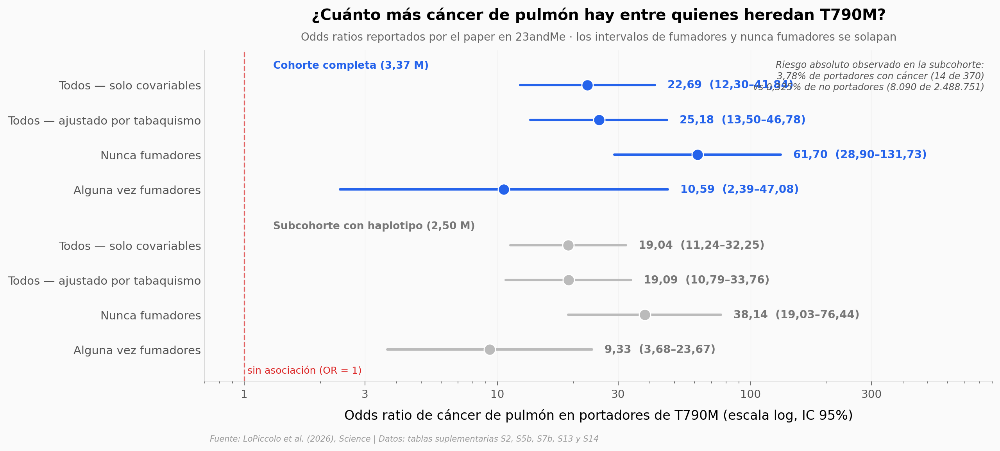

# 1 de cada 2.078. ¿Por qué una variante de cáncer de pulmón se concentra en los Apalaches?

Una variante heredada del gen EGFR (T790M) que en el mundo lleva 1 de cada 15.850 personas aparece en 1 de cada 2.078 en los Apalaches del sur. En 3,37 millones de participantes de 23andMe, los portadores tienen 25 veces más probabilidades de cáncer de pulmón, y la asociación es varias veces mayor en quienes nunca fumaron. En 41 familias, la variante acompaña al cáncer en 24 pares de hermanos y en 0 va al revés.

**El hallazgo:** OR de 25,18 (IC 95% 13,50–46,78) — pero en riesgo absoluto, 3,784% de los portadores con cáncer frente al 0,325% de los no portadores. Y las 51 regiones de EE. UU. comparten el doble de genoma con los portadores que las 449 del resto del mundo.

## Gráfica clave



## Reproducir

[](https://colab.research.google.com/github/Ciencia-a-Mordiscos/lab/blob/main/papers/2026-09-18-egfr-t790m-cancer-pulmon-apalaches/notebook.ipynb)

O localmente:
```bash
pip install pandas matplotlib numpy scipy
jupyter execute notebook.ipynb
```

## Datos

- `datos/modelos_asociacion.csv` — 8 odds ratios con IC 95% y p transcritos de las tablas S2 (cohorte completa, 3,37 M) y S7b (subcohorte con haplotipo, 2,50 M)
- `datos/conteos_por_grupo.csv` — casos/controles por grupo en la subcohorte con haplotipo (2.496.375 personas), tabla S7b
- `datos/pedigris_inherit.csv` — 1.145 individuos en 41 pedigríes INHERIT, tabla S5b, genotipo recodificado según el código de los autores
- `datos/ibd_estados.csv` — 500 regiones del mundo × 7 grupos de ancestría, IBD medio con portadores (cM por residente), tabla S13
- `datos/ibd_condados_eeuu.csv` — 500 condados de EE. UU. × 7 grupos de ancestría, tabla S14

## Links

- **Video:** [Pendiente]
- **Paper:** [Science — DOI: 10.1126/science.aec0473](https://doi.org/10.1126/science.aec0473)
- **Datos originales:** [Material suplementario del paper](https://www.science.org/doi/suppl/10.1126/science.aec0473) · [código de los autores](https://github.com/sashagusev/egfr-t790m)
