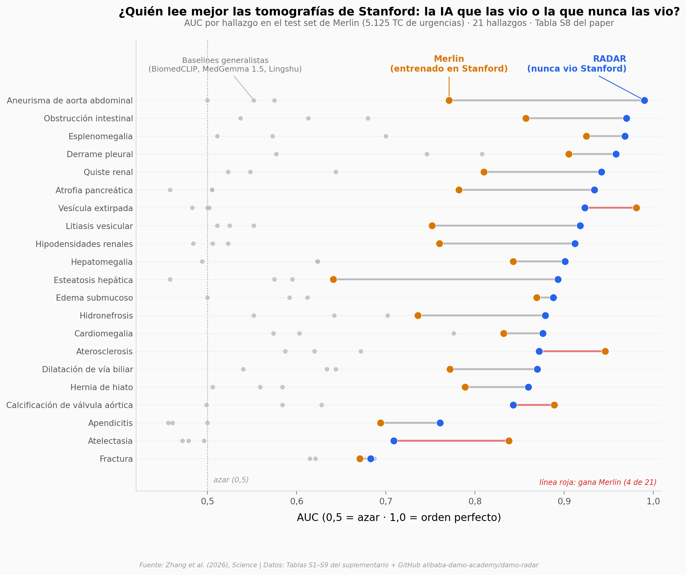

# Una IA que nunca vio un hospital de Stanford lee sus tomografías mejor que la IA entrenada allí

RADAR, un modelo de visión y lenguaje entrenado en China con 424.911 tomografías abdominales y 15 millones de pares imagen-texto extraídos de informes clínicos, clasifica 21 hallazgos en las 5.125 TC del test set de Merlin (Stanford) con un AUC medio de 0,883 — sin haber visto ni una de ellas. Merlin, entrenado con datos de ese mismo hospital, llega a 0,812. En casa, RADAR alcanza 0,913 en 146 hallazgos y es el mejor de cuatro modelos en 138 de ellos.

**El hallazgo:** RADAR supera a Merlin en 17 de 21 hallazgos del test set de Merlin (diferencia pareada +0,071, d = 0,73, Wilcoxon p = 0,006, n = 21) y sostiene medias de 0,874–0,912 en ocho hospitales externos — pero 96 de 818 celdas hallazgo×centro quedan por debajo de 0,8 y en 9 hallazgos fuera de alcance la ventaja se invierte.

## Gráfica clave



## Reproducir

[](https://colab.research.google.com/github/Ciencia-a-Mordiscos/lab/blob/main/papers/2026-09-18-radar-ia-generalista-tc-abdominal/notebook.ipynb)

O localmente:
```bash
pip install pandas matplotlib numpy scipy
jupyter execute notebook.ipynb
```

## Datos

- `datos/merlin_test_auc_por_modelo.csv` — Tabla S8: AUC por hallazgo (21 in-scope + 9 fuera de alcance) de 6 modelos en el test set de Merlin
- `datos/auc_interno_146_hallazgos.csv` — Tabla S2: AUC de CT-CLIP, Merlin, fVLM y RADAR en 146 hallazgos de la cohorte interna (39.160 exámenes), con estrellas de significancia del paper
- `datos/auc_externo_8_centros.csv` — Tabla S7: AUC de RADAR por hallazgo y centro externo (818 celdas, 46 hallazgos en los 8 centros)
- `datos/positivos_por_cohorte.csv` — Tabla S1: etiquetas positivas por hallazgo y cohorte
- `datos/lectores_reader_study.csv` — Tabla S9: demografía de los 26 radiólogos del reader study
- `datos/radar_scores_merlin_test.csv` — scores crudos de RADAR (20 hallazgos × 5.125 TC) del repositorio de los autores; sin ground truth (etiquetas de Merlin bajo acuerdo de uso)

## Links

- **Video:** [Pendiente]
- **Paper:** [Science — DOI: 10.1126/science.aec6129](https://doi.org/10.1126/science.aec6129)
- **Datos originales:** [Supplementary Tables S1–S13](https://www.science.org/doi/suppl/10.1126/science.aec6129/suppl_file/science.aec6129_tables_s1_to_s13.zip) · [alibaba-damo-academy/damo-radar](https://github.com/alibaba-damo-academy/damo-radar)
