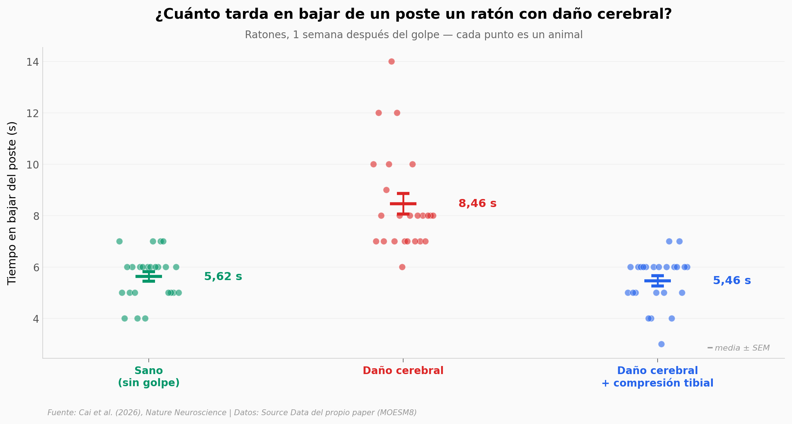

# Le apretaron la tibia y el cerebro se recuperó

Tras un golpe fuerte en la cabeza los huesos sanan más rápido: el cerebro lesionado le manda
señales al hueso. Cai y su equipo probaron la dirección contraria. Comprimieron la tibia de
ratones con daño cerebral —una carga mecánica suave, sin cirugía ni fármacos— y midieron la
recuperación. Después quitaron el sensor mecánico del hueso para ver si el efecto desaparecía,
transfirieron suero de un ratón a otro para ver si la señal viajaba por la sangre, y repitieron
el experimento en cerdos.

**El hallazgo:** un ratón con daño cerebral tarda **8,46 s** en bajar de un poste; con
compresión tibial, **5,46 s** — y un ratón sano tarda 5,62 s (d = 1,94; n = 24 por grupo).
El beneficio se apaga si se les quita **PIEZO1** a los osteocitos, y el suero de un ratón
comprimido lo reproduce en otro que nunca pisó la máquina.

## Gráfica clave



## Reproducir

[](https://colab.research.google.com/github/Ciencia-a-Mordiscos/lab/blob/main/papers/2026-09-22-compresion-tibia-cerebro/notebook.ipynb)

O localmente:

```bash
pip install pandas matplotlib numpy scipy
jupyter execute notebook.ipynb
```

## Datos

Los seis CSV salen del *Source Data* del propio paper (MOESM8), un archivo por familia de
figuras. Los `n` de cada columna se cruzaron contra los declarados en las leyendas de las
Figs. 1, 2, 3, 4 y 7.

- `datos/pole_test_raton.csv` — prueba del poste en ratón, Fig. 1c/1d. 224 filas, 1 y 8 semanas
- `datos/mwm_raton.csv` — laberinto acuático de Morris, Fig. 1f/1g. 224 filas
- `datos/histologia_hipocampo.csv` — MAP2 y neuronas Nissl+ en hipocampo, Fig. 2c/2d. 130 filas
- `datos/piezo1_ko.csv` — deleción de Piezo1 en osteocitos, Fig. 3d-3h. 236 filas, 4 grupos
- `datos/suero_transferencia.csv` — transferencia pasiva de suero, Fig. 4b-4f. 180 filas
- `datos/cerdos_tmaze.csv` — cerdos en el laberinto en T, Fig. 7c/7d. 78 filas, 3 momentos

## Alcance y limitaciones

- **Ratones y cerdos.** No hay ni un dato humano en el paper.
- Las `p` del notebook son Mann-Whitney U par a par; el paper usa análisis con corrección por
  comparaciones múltiples. Las direcciones coinciden, los valores de `p` no son los del paper.
  Donde se pudo cruzar, las diferencias de medias sí coinciden (cuadrante diana: 8,955 s
  frente a los 8,953 s del paper).
- A 4 semanas quedan 3 cerdos por grupo: ahí el test se queda sin resolución (p = 0,1 es su
  suelo) y solo informa el tamaño de efecto.
- Las cuantificaciones de las Figs. 2c y 2d no traen unidad declarada en la leyenda del paper.

## Links

- **Video:** [Ver en YouTube](https://youtube.com/shorts/G7a9B1WtqZE)
- **Paper:** [Nature Neuroscience — DOI: 10.1038/s41593-026-02422-w](https://doi.org/10.1038/s41593-026-02422-w)
- **Datos originales:** [Source Data (MOESM8)](https://media.springernature.com/original/springer-static/esm/art%3A10.1038%2Fs41593-026-02422-w/MediaObjects/41593_2026_2422_MOESM8_ESM.xlsx)
