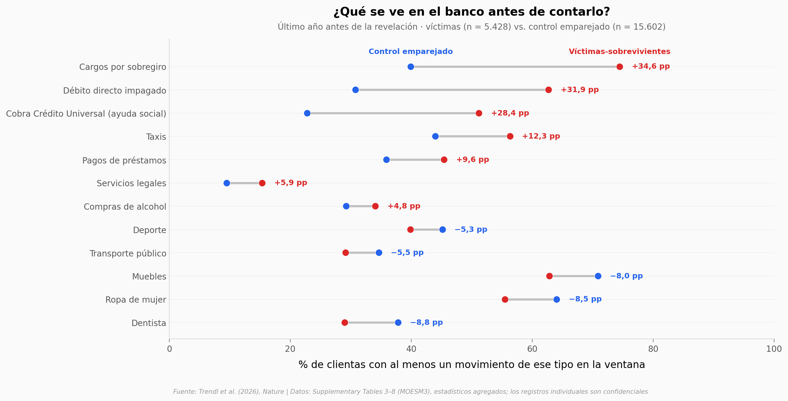

# El abuso financiero, visto desde los registros del banco

Un equipo comparó 5.428 mujeres que le contaron a un gran banco británico que sufrían abuso financiero
con 15.602 clientas parecidas sin ninguna revelación. En el último año, las diferencias saltan a la
vista: más cargos por sobregiro, más débitos que rebotan, más ayudas sociales, menos dentista y menos
ahorro. Y muchas de esas señales ya estaban ahí entre 7 y 3,5 años antes.

**El hallazgo:** **el 74,5 % de las víctimas-sobrevivientes pagó cargos por sobregiro en el último año,
frente al 39,9 % del control** — aunque la mayoría de las 161 diferencias significativas son muy pequeñas
(mediana del tamaño de efecto: 0,091).

## Gráfica clave



## Reproducir

[](https://colab.research.google.com/github/Ciencia-a-Mordiscos/lab/blob/main/papers/2026-09-23-abuso-financiero-registros-bancarios/notebook.ipynb)

O localmente:
```bash
pip install pandas matplotlib numpy
jupyter execute notebook.ipynb
```

## Datos

- `datos/diferencias_373_indicadores.csv` — muestra principal: 373 indicadores × 3 ventanas (1.119 filas), medias ponderadas, IC 95 %, p ajustada y tamaño de efecto aproximado
- `datos/sensibilidad_tres_muestras_ultimo_anio.csv` — último año con tres grupos control distintos (1.119 filas)
- `datos/referencia_poblacion_banco.csv` — medias descriptivas de la clientela del banco (776 filas)
- `datos/balance_emparejamiento.csv` — balance de 12 covariables antes y después del emparejamiento (24 filas)

Son estadísticos agregados de las Supplementary Tables del paper: los registros bancarios individuales son confidenciales.

## Links

- **Video:** [Pendiente]
- **Paper:** [Nature — DOI: 10.1038/s41586-026-11049-7](https://doi.org/10.1038/s41586-026-11049-7)
- **Datos originales:** [Supplementary Tables 3–10 (MOESM3)](https://media.springernature.com/original/springer-static/esm/art%3A10.1038%2Fs41586-026-11049-7/MediaObjects/41586_2026_11049_MOESM3_ESM.zip)
