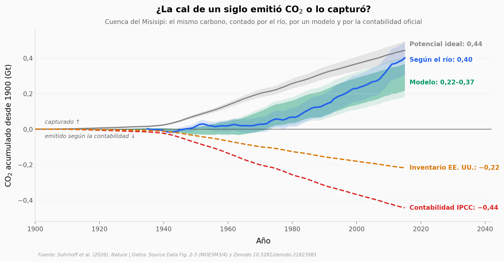

# ¿La cal agrícola emite CO₂ o lo captura?

Entre 1900 y 2015 se echó a los cultivos de la cuenca del Misisipi cal suficiente para capturar, en el mejor de los casos, 0,44 gigatoneladas de CO₂. La contabilidad por defecto del IPCC anota esa misma cifra como emitida. El río cuenta otra historia: el exceso de bicarbonato que lleva al golfo de México sugiere que se realizó la mayor parte de ese potencial, con décadas de retraso. Un modelo del suelo lo encuentra también, aunque con un pulso inicial de emisiones.

**El hallazgo:** **los registros del río sugieren que se realizó cerca del 90 % (± 21 %) del potencial de captura de la cal; el modelo da entre el 49 y el 83 %** — siempre frente a la misma acidez sin cal.

## Gráfica clave



## Reproducir

[](https://colab.research.google.com/github/Ciencia-a-Mordiscos/lab/blob/main/papers/2026-09-23-encalado-agricola-sumidero-carbono/notebook.ipynb)

O localmente:
```bash
pip install pandas matplotlib numpy
jupyter execute notebook.ipynb
```

## Datos

- `datos/cdr_acumulado.csv` — CO₂ acumulado 1900-2015 (GtCO₂): potencial, río, modelo SCEPTER y contabilidades (116 años)
- `datos/emisiones_co2_anuales.csv` — emisiones anuales del suelo con y sin cal en el modelo (MtCO₂/año, 116 años)
- `datos/balance_acido_alcalino_mrb.csv` — seis fuentes de acidez y cal añadida, media de la cuenca (mol H⁺/ha/año, 116 años)
- `datos/rio_bicarbonato.csv` — caudal y bicarbonato del Misisipi (116 años, 100 con dato)
- `datos/escenarios_scepter_MtCO2.csv` — 20 escenarios del modelo (116 años)

## Links

- **Video:** [Pendiente]
- **Paper:** [Nature — DOI: 10.1038/s41586-026-11040-2](https://doi.org/10.1038/s41586-026-11040-2)
- **Datos originales:** [Zenodo — 10.5281/zenodo.21823981](https://doi.org/10.5281/zenodo.21823981) y Source Data del paper (MOESM3/MOESM4)
