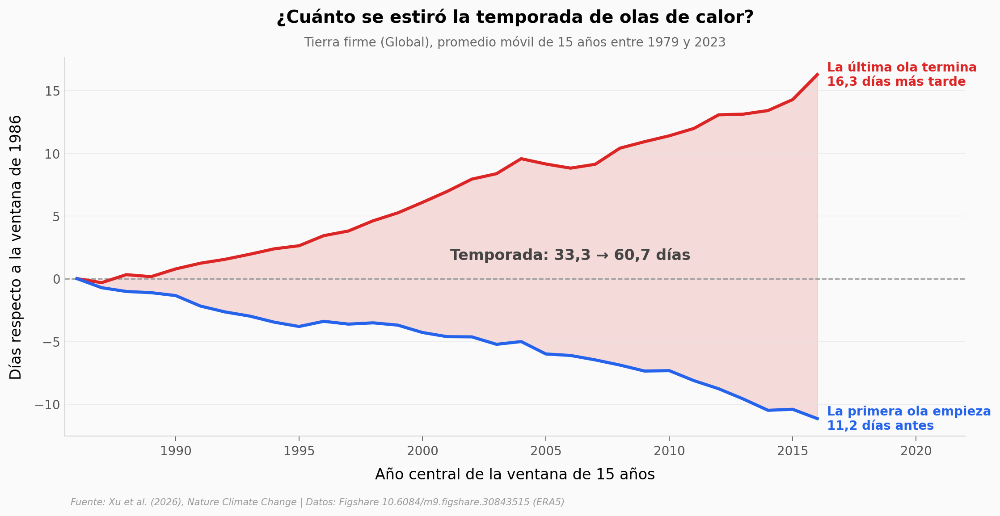

# Las olas de calor llegan antes y se van después

Entre 1979 y 2023, en la tierra firme, la primera ola de calor del año llegó cada vez antes y la última se fue cada vez más tarde. Entre la ventana de 15 años centrada en 1986 y la centrada en 2016, la temporada de olas de calor pasó de 33,3 a 60,7 días. La tendencia va en esa dirección en el 92,1 % de la tierra, aunque punto por punto la señal es ruidosa: tras corregir por comparaciones múltiples, solo el 13,5 % se distingue del azar.

**El hallazgo:** **la temporada de olas de calor se alarga 8,71 ± 0,17 días por década** (el inicio se adelanta 3,29 y el final se retrasa 5,41).

## Gráfica clave



## Reproducir

[](https://colab.research.google.com/github/Ciencia-a-Mordiscos/lab/blob/main/papers/2026-09-23-olas-de-calor-antes-y-mas-largas/notebook.ipynb)

O localmente:
```bash
pip install pandas matplotlib numpy scipy
jupyter execute notebook.ipynb
```

## Datos

- `datos/tendencias_15a_por_zona.csv`: inicio, fin y duración de la temporada en medias móviles de 15 años, global y por zona de aridez (186 filas, ventanas centradas 1986–2016)
- `datos/resumen_fracciones_tierra.csv`: % de tierra con cada tendencia, significativa punto a punto y tras FDR (18 filas)
- `datos/histograma_tendencias_celdas.csv`: distribución de las tendencias por punto, ponderada por área (80 bins)
- `datos/tipos_inicio_primera_ola.csv`: tipo de inicio (rápido, moderado, lento) de la primera ola, 1979–2023 (45 filas)
- `datos/tmax_diaria_estaciones_era5.csv`: temperatura máxima diaria ERA5 en 5 estaciones de prueba (16.425 días)
- `datos/olas_por_anio_estaciones_autores.csv`: salida del detector de los autores para esas estaciones (225 filas)
- `datos/estaciones.csv`, `datos/mapa_tendencias_1grado.csv`, `datos/perfil_latitudinal.csv`: estaciones, mapa de tendencias a 1° y perfil por latitud

## Links

- **Video:** [Pendiente]
- **Paper:** [Nature Climate Change — DOI: 10.1038/s41558-026-02762-2](https://doi.org/10.1038/s41558-026-02762-2)
- **Datos originales:** [Figshare — 10.6084/m9.figshare.30843515](https://doi.org/10.6084/m9.figshare.30843515)
