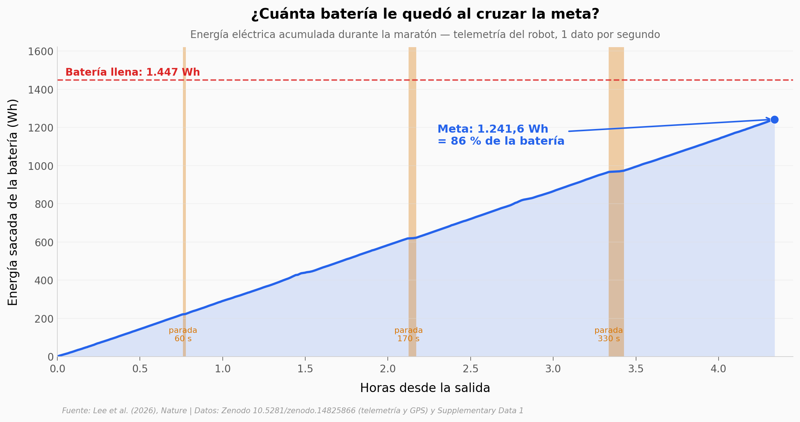

# Un robot de cuatro patas corrió una maratón con una sola batería

RAIBO2, un cuadrúpedo de 43 a 45 kg, completó la Maratón Gotgam de Sangju (Corea del Sur) en 4 h 19 min 52 s
sin cambiar de batería. Con su telemetría segundo a segundo reconstruimos cuánta energía gastó, cuánta le
quedó y cómo se compara con otros robots, animales y autos.

**El hallazgo:** **usó 1.241,6 Wh, el 86 % de la batería, y recalculamos un coste de transporte de 0,251 frente al 0,248 del paper.**
Queda por debajo de un humano caminando (0,377), no de uno corriendo (0,467), y su autonomía proyectada
es 2,61 veces la del mejor cuadrúpedo de la tabla, no «más de tres veces» todos.

## Gráfica clave



## Reproducir

[](https://colab.research.google.com/github/Ciencia-a-Mordiscos/lab/blob/main/papers/2026-09-23-robot-cuadrupedo-maraton-una-carga/notebook.ipynb)

O localmente:
```bash
pip install pandas matplotlib numpy
jupyter execute notebook.ipynb
```

## Datos

- `datos/telemetria_robot_1hz.csv` — batería y motores del robot, 1 fila por segundo (17.755 filas), 3 registros alineados al reloj del GPS
- `datos/recorrido_gps.csv` — track GPS de la carrera, 1 punto por segundo (15.943 puntos)
- `datos/cot_comparativa.csv` — Supplementary Data 1: masa, batería, autonomía y coste de transporte de robots, animales y autos (69 filas)

## Links

- **Video:** [Pendiente]
- **Paper:** [Nature — DOI: 10.1038/s41586-026-11102-5](https://doi.org/10.1038/s41586-026-11102-5)
- **Datos originales:** [Zenodo 10.5281/zenodo.14825866](https://doi.org/10.5281/zenodo.14825866) · [Supplementary Data 1](https://media.springernature.com/original/springer-static/esm/art%3A10.1038%2Fs41586-026-11102-5/MediaObjects/41586_2026_11102_MOESM1_ESM.xlsx)
