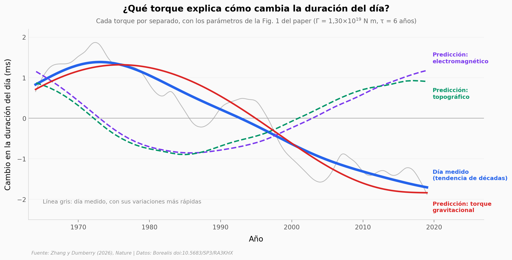

# ¿El núcleo interno de la Tierra alarga y acorta el día?

La duración del día cambia unos milisegundos de una década a otra. Con los datos de replicación de Zhang y Dumberry (2026, *Nature*) comparamos tres candidatos a producir esos cambios: el torque gravitacional del núcleo interno y los torques electromagnético y topográfico en el borde núcleo-manto. Con los parámetros de la Fig. 1 del paper, el gravitacional calca la tendencia de décadas; los otros dos van en sentido contrario.

**El hallazgo:** con Γ = 1,3×10¹⁹ N m y τ = 6 años, el torque gravitacional reproduce la forma de la tendencia de décadas del día entre 1964 y 2019 (r = 0,986, error RMS 0,215 ms). El paper lo lee como que ese torque *sería* el motor principal, si los modelos de rotación del núcleo interno y de flujo del núcleo son correctos.

## Gráfica clave



## Reproducir

[](https://colab.research.google.com/github/Ciencia-a-Mordiscos/lab/blob/main/papers/2026-09-23-torque-gravitacional-duracion-dia/notebook.ipynb)

O localmente:
```bash
pip install pandas matplotlib numpy scipy
jupyter execute notebook.ipynb
```

## Datos

- `datos/dlod_1964_2019.csv` — cambio en la duración del día (ms), diario, 1964–2019 (20.089 filas): serie corregida y tendencia filtrada a más de 30 años. El año se reconstruyó con paso diario (1964,0 + i/365,25) porque el export venía redondeado a 2 decimales.
- `datos/torques_cmb_ensemble.csv` — torques electromagnético (referencia G = 3×10⁸ S) y topográfico (K_top = 1) en el borde núcleo-manto, anuales (56 filas).
- `datos/alpha_nucleo_interno_tau6.csv` — desalineación media α del núcleo interno para τ = 6 años, semestral (111 filas).
- `datos/posterior_em.csv`, `datos/posterior_top.csv` — muestras del MCMC (Γ, τ, K, misfit χ, probabilidad) con probabilidad > 0,3: 25.094 y 28.058 de las 90.000 de cada acoplamiento.

## Links

- **Video:** [Pendiente]
- **Paper:** [Nature — DOI: 10.1038/s41586-026-10999-2](https://doi.org/10.1038/s41586-026-10999-2)
- **Datos originales:** [Borealis — doi:10.5683/SP3/RA3KHX](https://doi.org/10.5683/SP3/RA3KHX)
