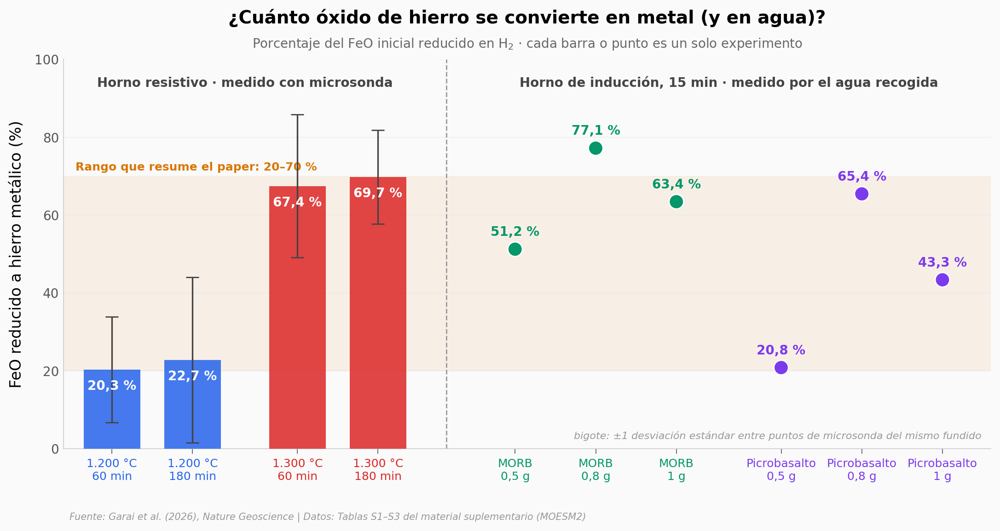

# ¿Puede salir agua de una roca seca y un chorro de hidrógeno?

Fundieron basalto sin agua en una corriente de hidrógeno caliente, como la que pudo envolver a la Tierra mientras crecía atrapando guijarros de roca. El hidrógeno le quita el oxígeno al óxido de hierro: queda hierro metálico y sale vapor de agua. En 15 minutos, cada gramo de roca soltó entre 6,0 y 24,7 mg de agua, y el metal que se forma se lleva casi todo el fósforo del silicato a 1.300 °C.

**El hallazgo:** pasar de 1.200 a 1.300 °C sube la fracción de FeO reducido de 20,3 % a 67,4 %; alargar el experimento de 1 a 3 horas suma apenas 2 puntos.

## Gráfica clave



## Reproducir

[](https://colab.research.google.com/github/Ciencia-a-Mordiscos/lab/blob/main/papers/2026-09-24-agua-desde-guijarros-secos-e-hidrogeno/notebook.ipynb)

O localmente:
```bash
pip install pandas matplotlib numpy
jupyter execute notebook.ipynb
```

## Datos

- `datos/experimentos_tabla_s1.csv` — 11 experimentos (Tabla S1): masas, pérdidas y agua en las etapas de helio y H₂
- `datos/microsonda_tabla_s2_largo.csv` — cada análisis de microsonda (Tabla S2), formato largo
- `datos/microsonda_resumen_por_fase.csv` — media, DE y n por bloque y fase (derivado de la Tabla S2)
- `datos/eficiencia_reduccion.csv` — eficiencia de reducción del FeO por experimento (10 filas, fórmula del SI §S3)
- `datos/isotopos_dD_tabla_s3.csv` — δD del agua producida y del H₂ del tanque (Tabla S3)

## Links

- **Video:** [Pendiente]
- **Paper:** [Nature Geoscience — DOI: 10.1038/s41561-026-02118-7](https://doi.org/10.1038/s41561-026-02118-7)
- **Datos originales:** [Supplementary Tables S1–S4 (MOESM2)](https://media.springernature.com/original/springer-static/esm/art%3A10.1038%2Fs41561-026-02118-7/MediaObjects/41561_2026_2118_MOESM2_ESM.xlsx) · Dryad [10.5061/dryad.fttdz0980](https://doi.org/10.5061/dryad.fttdz0980) (aún sin publicar)
