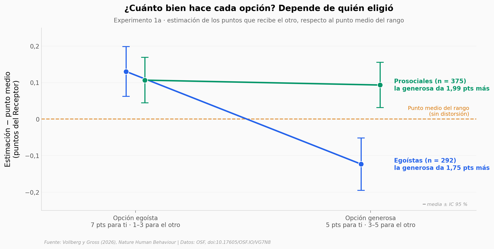

# Egoístas y generosos maquillan el impacto de sus decisiones

Cuando lo que tu decisión le hace a otra persona no está claro, ¿lo estimas con frialdad o a tu favor? En 9 experimentos con 8.769 adultos, quienes eligieron quedarse con más puntos reportaron, en promedio, que la opción generosa le daba al otro menos ventaja de la real. Y ver esa distorsión en otra persona empujó a más gente a elegir lo egoísta.

**El hallazgo:** en el Experimento 1a, los egoístas vieron las dos opciones más parecidas que los prosociales (b = 0,24; IC 95 % 0,14–0,34), pero la mediana fue 0: el efecto lo arrastra una minoría. En el Experimento 6, ver a un Influencer con el patrón egoísta subió la elección egoísta de 43,6 % a 55,8 %.

## Gráfica clave



## Reproducir

[](https://colab.research.google.com/github/Ciencia-a-Mordiscos/lab/blob/main/papers/2026-10-01-egoistas-y-prosociales-distorsionan-su-impacto/notebook.ipynb)

O localmente:
```bash
pip install pandas matplotlib numpy scipy
jupyter execute notebook.ipynb
```

## Datos

- `datos/exp1a_estimaciones.csv` — Experimento 1a: 981 Decisores, tipo de decisor y sus estimaciones de los puntos del Receptor (desviación respecto al punto medio del rango)
- `datos/exp6_seguidores.csv` — Experimento 6: 849 seguidores, condición del Influencer asignada al azar, elección y estimaciones
- `datos/resumen_experimentos.csv` — brecha prosociales − egoístas por experimento (9 filas; diferencias de medias crudas con IC de Welch)
- `datos/tipos_distorsion_exp1ab.csv` — 9 patrones de distorsión por tipo de decisor en los Experimentos 1a y 1b (18 filas)

## Links

- **Video:** [Pendiente]
- **Paper:** [Nature Human Behaviour — DOI: 10.1038/s41562-026-02585-3](https://doi.org/10.1038/s41562-026-02585-3)
- **Datos originales:** [OSF — 10.17605/OSF.IO/VG7N8](https://doi.org/10.17605/OSF.IO/VG7N8)
